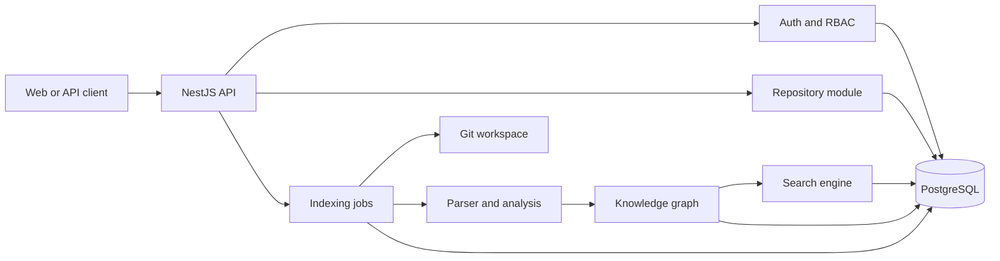

# CodeMind API

CodeMind is a repository intelligence platform that converts source code into
structured, searchable knowledge. This repository contains the NestJS backend
responsible for authentication, repository management, incremental indexing,
code analysis, knowledge extraction, and source-grounded search.

## What the system does

```text
Git repository
    ↓
Clone or pull source
    ↓
Discover and hash files
    ↓
Parse TypeScript and JavaScript
    ↓
Extract symbols and dependencies
    ↓
Build versioned knowledge snapshots
    ↓
Publish a searchable repository index
```

The platform helps developers locate implementation details, understand
dependencies, inspect business rules and workflows, and prepare authorized
context for a future AI assistant.

## Current capabilities

- Organization registration and tenant-isolated user management
- JWT authentication with rotating refresh sessions
- Argon2id password hashing, rate limiting, and authentication audit events
- Role-based access control with seeded roles and permissions
- Repository registration, membership, branch synchronization, and health
- GitHub HTTPS and allow-listed local Git repository support
- Durable background indexing and knowledge jobs backed by PostgreSQL
- Incremental indexing using Git blob identity and SHA-256 content hashes
- TypeScript and JavaScript parsing
- File, symbol, import, export, and dependency extraction
- Business-rule, workflow, state, event, and architecture analysis
- Immutable, published knowledge snapshots with source evidence
- Exact, PostgreSQL full-text, filtered, and graph-expanded search
- Tenant-scoped APIs with permission checks and provenance-aware results

The AI/RAG architecture is documented, but the runtime assistant and LLM
provider integration are not yet implemented. Embeddings and pgvector are
deferred until search evaluation shows that semantic retrieval is needed.

## Architecture



Long-running indexing and knowledge builds do not run inside the HTTP request.
The API creates a job and returns; in-process NestJS workers poll PostgreSQL,
claim jobs with leases, update heartbeats and progress, retry transient
failures, and publish completed snapshots. Redis, BullMQ, RabbitMQ, Kafka, and
SQS are not required for the current single-service deployment.

## Technology

| Area               | Technology                            |
| ------------------ | ------------------------------------- |
| Runtime            | Node.js 20+                           |
| Framework          | NestJS 11                             |
| Language           | TypeScript                            |
| Database           | PostgreSQL                            |
| ORM and migrations | TypeORM                               |
| Authentication     | JWT access and refresh tokens         |
| Password hashing   | Argon2id                              |
| Validation         | class-validator and class-transformer |
| Testing            | Jest and Supertest                    |
| Git integration    | Git CLI                               |

## Requirements

Install these tools before starting:

- Node.js 20 or later
- Yarn Classic (1.x)
- PostgreSQL
- Git

## Local installation

### 1. Install dependencies

```bash
yarn install
```

### 2. Create the database

Create a PostgreSQL database named `codemind` using pgAdmin, or run:

```bash
createdb codemind
```

If the command-line tool is unavailable, create the database from pgAdmin and
continue with the next step.

### 3. Create the environment file

macOS or Linux:

```bash
cp .env.example .env
```

Windows PowerShell:

```powershell
Copy-Item .env.example .env
```

At minimum, review these values in `.env`:

```dotenv
APP_HOST=0.0.0.0
APP_PORT=3000
WEB_APP_URL=http://localhost:3001

DATABASE_HOST=localhost
DATABASE_PORT=5432
DATABASE_USER=postgres
DATABASE_PASSWORD=your_postgres_password
DATABASE_NAME=codemind
DATABASE_SSL=false

JWT_SECRET=replace_with_a_secret_at_least_32_characters
JWT_REFRESH_SECRET=replace_with_a_different_secret_at_least_32_characters
```

Use unique, securely generated JWT secrets. Do not commit the `.env` file.

### 4. Apply database migrations

```bash
yarn migration:run
```

### 5. Seed roles and permissions

```bash
yarn seed
```

The seed is idempotent and can be run again when permission definitions change.

### 6. Start the API

```bash
yarn start:dev
```

The default endpoints are:

- API base URL: `http://localhost:3000/api/v1`
- Health check: `http://localhost:3000/health`

A successful health response includes the API status and PostgreSQL connection
status.

## Background processing

These workers are enabled by default in `.env.example`:

```dotenv
INDEXING_WORKER_ENABLED=true
KNOWLEDGE_WORKER_ENABLED=true
```

Repository files are stored beneath these local runtime directories by default:

- `.codemind/repositories/` for managed Git workspaces
- `.codemind/indexing/` for isolated indexing workspaces

They are runtime data and should not be committed. Production deployments
should mount persistent storage and run only one worker instance unless the
database lease and workspace strategy has been reviewed for multi-instance use.

## Useful commands

| Command                                            | Purpose                                      |
| -------------------------------------------------- | -------------------------------------------- |
| `yarn start:dev`                                   | Start the API with file watching             |
| `yarn build`                                       | Compile the production build                 |
| `yarn start:prod`                                  | Run the compiled application                 |
| `yarn lint`                                        | Run ESLint and apply safe fixes              |
| `yarn format`                                      | Format TypeScript source and tests           |
| `yarn test`                                        | Run unit tests                               |
| `yarn test:e2e:db:create`                          | Create the isolated end-to-end test database |
| `yarn test:e2e`                                    | Run end-to-end tests                         |
| `yarn migration:show`                              | Show migration state                         |
| `yarn migration:generate -- path/to/MigrationName` | Generate a migration from entity changes     |
| `yarn migration:create -- path/to/MigrationName`   | Create an empty migration                    |
| `yarn migration:run`                               | Apply pending migrations                     |
| `yarn migration:revert`                            | Revert the latest migration                  |
| `yarn seed`                                        | Seed roles and permissions                   |
