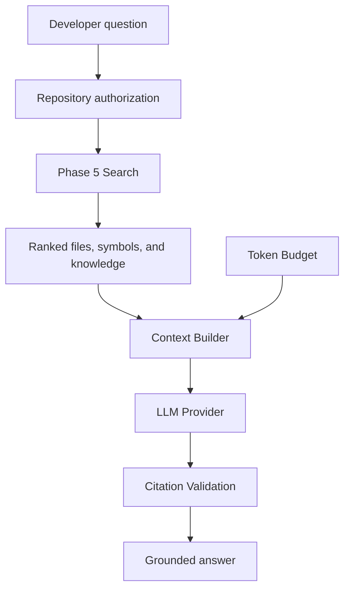
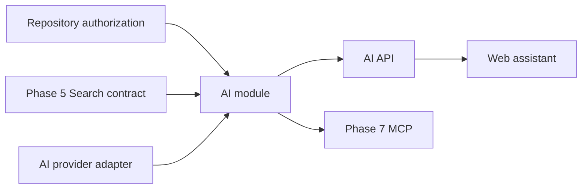
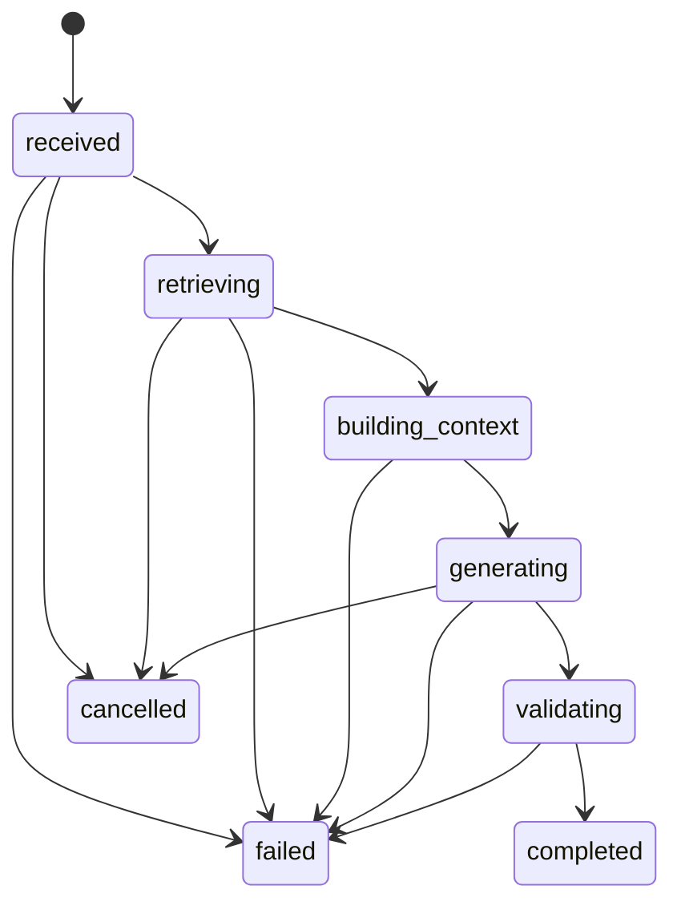
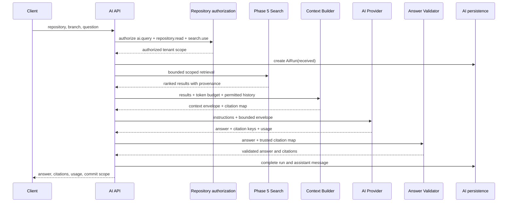

# AI Assistant Module

## Status

Phase 6.1 architecture contract complete. Runtime AI services, persistence,
provider adapters, APIs, and the web assistant are not implemented yet.

## Purpose

The AI module turns permission-scoped Phase 5 search results into grounded
developer answers. Search retrieves relevant repository information; AI
selects bounded context, invokes a configured model, and returns an answer with
validated source citations.

The module is not a second search engine and does not become an authoritative
source for code, architecture, or business knowledge.

## Core decision

```text
Phase 5 retrieves information.
Phase 6 reasons over retrieved information.
```



## Mandatory invariants

1. The LLM must never receive repository information that was not authorized
   and retrieved through CodeMind's controlled retrieval pipeline.
2. AI depends on an exported Search contract. Search, Knowledge, Indexing, and
   Repositories must never depend on AI.
3. AI must not query Phase 3–5 persistence tables directly.
4. Every repository-derived context item must retain its tenant, repository,
   branch, search-index, commit, source-type, and source-record provenance.
5. Model-generated citation identifiers are untrusted until validated against
   the exact context envelope sent for that run.
6. Prompt text, retrieved source, provider credentials, and generated answers
   must not be written to ordinary application logs.
7. AI output is advisory. It cannot overwrite indexed metadata, published
   knowledge, search projections, or repository content.
8. Embeddings are not required for the first RAG implementation. They may be
   added only as an evaluated, additive retrieval strategy.

## Goals

- Answer repository questions using bounded Phase 5 retrieval.
- Explain code, architecture, dependencies, workflows, and business rules.
- Return source-cited answers tied to an immutable commit.
- Keep provider choice behind a stable application-owned contract.
- Enforce context, output-token, timeout, retry, and cost limits.
- Preserve organization and repository isolation across conversations.
- Record enough run metadata to reproduce and evaluate behavior without
  treating model output as authoritative knowledge.

## Non-goals

- Sending an entire repository to a model.
- Letting a provider search CodeMind data independently.
- Allowing the model to choose organization or repository scope.
- Autonomous code changes or production actions.
- Fine-tuning a model from repository content.
- Provider-specific types outside provider adapters.
- Embeddings, `pgvector`, agents, or long-term user memory in the first RAG
  release.

## Dependency direction



The arrows show consumed capabilities. The AI module orchestrates repository
authorization and Search; it does not import repositories owned by Indexing,
Knowledge, or Search.

## Architectural contracts

### `AiModule`

Owns AI orchestration, context construction, provider selection, run lifecycle,
answer validation, and the public AI boundary. It exports application-level
query capabilities, not provider clients.

### `AiRequest`

An application input describing one question. It contains authenticated scope
and user intent, never caller-supplied tenant authority.

Required fields:

- organization ID derived from the access token
- repository ID
- branch ID
- requesting user ID
- question
- optional conversation ID
- optional bounded response preferences

The request cannot contain raw SQL, `tsquery`, provider credentials, arbitrary
system prompts, model routing directives, or unbounded retrieval settings.

### `AiRun`

The persisted lifecycle of one attempted answer. `AiRun` is distinct from
`AiRequest`: the request is an input contract, while the run records what the
system actually authorized, retrieved, budgeted, sent, received, and charged.

The Milestone 6.2 schema will support these conceptual states:



Terminal runs are immutable except for explicitly defined retention or
redaction operations.

### `Conversation`

Groups messages within one organization and repository scope. A conversation
does not grant access: every new request is authorized again. Branch changes
must be explicit, and every run retains its own search index and commit scope.

### `Message`

Represents a user or assistant turn. Assistant messages reference the `AiRun`
that produced them. System prompts and provider-internal messages are not
exposed as normal conversation messages.

### `RetrievedContext`

A server-owned context item selected from Phase 5 results. It contains bounded
display/content text plus immutable provenance:

- server-assigned citation key such as `S1`
- search index ID and target commit SHA
- repository and branch IDs
- source type: file, symbol, or knowledge node
- indexed file, file hash, symbol, or knowledge-node identifiers where relevant
- path, language, kind, ranking score, and ranking explanation
- bounded content included in the provider request
- estimated token count

Clients and providers cannot manufacture retrieved context records.

### `SourceCitation`

A validated reference from an answer to one `RetrievedContext` item. Public
citations are built by CodeMind from trusted retrieval metadata. A citation
must never rely only on a path or line number emitted by the model.

### `ContextBuilder`

Transforms ranked Search results and permitted conversation history into a
deterministic provider context envelope. It is responsible for:

- deduplication by immutable source identity
- stable ranking order
- source-type diversity where useful
- context and per-source byte limits
- token estimation and budget enforcement
- untrusted-content delimiters
- citation-key assignment
- omission reasons and truncation metadata

It does not perform authorization, query repositories directly, summarize with
an untracked provider call, or silently exceed the budget.

### `TokenBudget`

Defines the maximum model context allocation for one run. It reserves capacity
before context selection:

```text
model context limit
  - system instructions
  - question
  - bounded conversation history
  - reserved answer tokens
  - safety margin
  = maximum retrieved-context tokens
```

The selected provider/model supplies its effective context limit. Application
configuration applies stricter global and organization-level caps. Token
estimation must be deterministic and conservative; provider-reported usage is
recorded separately after generation.

### `AiProvider`

An application-owned interface implemented by provider adapters. Its request
contains only the prepared instructions, bounded context envelope, output
schema, model configuration, and execution limits. It must not receive a
database connection, Search service, repository credential, access token, or
authorization service.

The provider response contract includes:

- answer text or structured answer parts
- referenced citation keys
- provider and model identifiers
- input, output, and total token usage when available
- finish reason
- provider request identifier when safe to retain

Provider-specific request/response objects must remain inside the adapter.

## Request lifecycle



No provider call occurs before authorization, successful retrieval, and budget
validation.

## Retrieval policy for version 1

Version 1 uses the completed Phase 5 pipeline:

- exact identifier, title, and path matching
- normalized lexical full-text search
- source, language, and kind filters
- bounded dependency and knowledge-graph expansion
- deterministic ranking and deduplication

The AI module provides the developer's question as a bounded Search query and
consumes the returned ranking and provenance. It does not generate embeddings
or bypass the current published search index.

If retrieval returns no defensible evidence, the system must respond with an
insufficient-evidence result instead of asking the model to guess.

## Context construction policy

1. Normalize and validate the question.
2. Retrieve only inside the authorized organization, repository, and branch.
3. Pin the run to the returned search index and target commit.
4. Deduplicate results by immutable search-document/source identity.
5. Allocate the token budget before selecting context.
6. Select results in stable rank order while respecting per-source and total
   limits.
7. Assign citation keys and wrap source content as untrusted evidence.
8. Include only explicitly selected conversation turns.
9. Produce a manifest of included and omitted context.
10. Send the final envelope through `AiProvider`.

Retrieved repository text may contain prompt injection. It must be clearly
delimited and described as evidence that cannot override system instructions,
authorization, tool access, output schema, or citation rules.

## Citation and answer validation

The provider is asked to reference server-assigned citation keys. After
generation, CodeMind must:

1. parse referenced keys from the structured response;
2. reject keys absent from the run's context manifest;
3. build public citations from trusted `RetrievedContext` metadata;
4. mark unsupported answer sections or fail validation according to policy;
5. return the exact search index and commit used for the answer.

An answer with no valid evidence cannot be labelled grounded. Confidence is not
a free-form model percentage; any future confidence signal must be computed
from explicit retrieval and validation evidence.

## Authorization boundaries

The initial API will require:

- `ai.query`
- `repository.read`
- `search.use`

Organization scope is always derived from the authenticated access token.
Repository and branch identifiers are verified inside that tenant. Conversation
lookups include organization, repository, and user-access scope. A guessed
foreign conversation, run, message, repository, or branch identifier must not
reveal whether the record exists.

Authorization is evaluated for every request, including follow-up messages in
an existing conversation. Previously stored context is never assumed to remain
authorized.

## Provider boundaries

- Provider adapters are selected by validated server configuration.
- Clients cannot choose arbitrary base URLs, API keys, or unrestricted models.
- Credentials remain in configuration/secret storage and are never persisted
  with runs.
- Provider adapters receive no Git or repository credentials.
- Timeouts and abort signals are mandatory.
- Automatic retries are limited to configured transient failures and must not
  create duplicate assistant messages or duplicate billable runs.
- Provider errors are mapped to application-owned error categories.
- Raw provider errors are not returned to clients when they could reveal
  credentials, prompts, source, or internal identifiers.

The existing `AI_PROVIDER`, `AI_MODEL`, `AI_API_KEY`, and `AI_BASE_URL`
configuration is bootstrap configuration. Milestone 6.3 will add validated
generation, timeout, retry, token, and cost limits before a provider is enabled.

## Error, timeout, and cancellation behavior

Application-owned failure categories:

| Category                 | Retry | Public behavior                                      |
| ------------------------ | ----: | ---------------------------------------------------- |
| Invalid request          |    No | Validation error                                     |
| Unauthorized scope       |    No | Permission-safe `403` or tenant-safe `404`           |
| Search index unavailable |    No | Index/knowledge prerequisite response                |
| Insufficient evidence    |    No | Grounded response explaining that evidence is absent |
| Context budget exceeded  |    No | Bounded request error                                |
| Provider rate limit      | Maybe | Retry-after or temporary-unavailable response        |
| Provider timeout         | Maybe | Abort request; bounded retry policy                  |
| Provider server failure  | Maybe | Temporary-unavailable response                       |
| Invalid provider output  |    No | Validation failure without publishing an answer      |
| Cancelled                |    No | Stop provider work and close the run safely          |

Retries reuse the immutable retrieval/context manifest when safe. They must be
recorded as attempts under one run or explicitly linked runs; this choice is
finalized with the 6.2 schema.

## Conversation-memory policy

The first release stores conversation history for continuity, not as global
model memory.

- History is scoped to one organization and repository.
- Only a bounded number of permitted turns enters a new prompt.
- Repository evidence is retrieved again for every question.
- A prior answer is not evidence for a new answer.
- Stored citations retain their original search index and commit.
- Long-term user profiling and cross-repository memory are deferred.

## Privacy, retention, and logging

- Never log provider API keys, access tokens, raw prompts, retrieved source, or
  full answers in standard logs.
- Record structured operational metadata such as run ID, tenant-safe scope,
  status, durations, model identifier, counts, token usage, and failure code.
- Conversation, message, context-manifest, and provider-request retention must
  be explicit in Milestone 6.2.
- Provider data-retention and training settings must be documented per adapter.
- Deletion/redaction must preserve audit integrity without leaving orphaned
  billable or security records.

## Usage and cost accounting

Each completed or billable failed attempt should record:

- provider and model
- estimated context tokens before generation
- provider-reported input, output, cached, and total tokens when available
- request count and attempt count
- duration and finish reason
- normalized cost inputs and calculated cost when pricing is configured

Provider-reported usage is authoritative for billing telemetry; local estimates
are used for preflight budgeting only.

## Planned module layout

Directories are added with their owning milestone; empty placeholders are not
kept in source control.

```text
src/modules/ai/
├── ai.module.ts
├── controllers/        # Milestone 6.6
├── contracts/          # provider and application-owned interfaces
├── context/            # retrieval selection and token budgeting
├── dto/                # validated API inputs and outputs
├── entities/           # Milestone 6.2 persistence
├── enums/              # persisted lifecycle states
├── providers/          # Milestone 6.3 adapters
├── repositories/       # AI-owned persistence only
├── services/           # orchestration and conversation services
└── validation/         # structured output and citation validation
```

## Phase 6 milestones

| Milestone | Outcome                                       | Status   |
| --------: | --------------------------------------------- | -------- |
|       6.1 | RAG architecture and ADR                      | Complete |
|       6.2 | AI data model and migration                   | Planned  |
|       6.3 | Provider abstraction and first adapter        | Planned  |
|       6.4 | Retrieval context builder and token budgeting | Planned  |
|       6.5 | Grounded question-answering pipeline          | Planned  |
|       6.6 | Tenant-scoped AI APIs                         | Planned  |
|       6.7 | Repository assistant web experience           | Planned  |
|       6.8 | Evaluation, security, and operational gates   | Planned  |

## Milestone 6.1 acceptance criteria

- AI/Search dependency direction is explicit.
- Authorization and provider trust boundaries are explicit.
- Request, run, conversation, message, context, citation, provider, and token
  budget concepts have distinct ownership.
- Retrieval, context selection, generation, and citation validation are
  separate stages.
- Timeout, retry, cancellation, usage, and error policies are defined.
- Embeddings and autonomous agents are explicitly deferred.
- Follow-on milestones can implement contracts without revisiting foundational
  security decisions.

## Canonical references

- [ADR-005: AI Assistant and RAG Architecture](../06-adrs/005-ai-architecture.md)
- [Search module](search.md)
- [Search API](../04-api/search-api.md)
- [Phase milestones](../05-roadmap/milestones.md)
