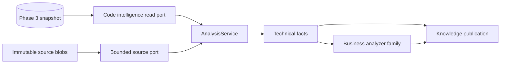

# Analysis Module

## Document information

Status: Milestone 4.2 implemented; knowledge persistence planned
Version: 2.1
Owner: CodeMind Engineering
Architecture decision:
[ADR-014](../06-adrs/014-knowledge-analysis-architecture.md)

## Purpose

The analysis module converts Phase 3 structural metadata and bounded immutable
source into normalized technical facts. It bridges syntax-level understanding
and the knowledge graph.

Phase 3 answers:

> Which files, symbols, imports, exports, and inheritance relationships exist?

Analysis answers:

> How do those symbols interact, what architectural roles do they play, and
> which source behaviors may support higher-level knowledge?

## Position in the pipeline



The analysis module produces facts. It does not publish snapshots or expose
public knowledge APIs.

## Inputs

An analysis run targets one successful Phase 3 index job and receives:

- Organization, repository, branch, and target commit identity
- Active indexed files and immutable current file hashes
- Code symbols and source ranges
- Import, export, `extends`, and `implements` dependencies
- Bounded source text only when an analyzer needs body-level syntax
- Analyzer bundle version and semantic configuration digest

Input access uses the exported Phase 3 read/source ports. Analysis services do
not import indexing TypeORM repositories or query Phase 3 tables directly.

## Outputs

Analyzers emit normalized facts in bounded batches. Planned fact families are:

- Call sites with explicit unresolved targets until Milestone 4.4
- Framework decorators and route metadata
- Constructor injection and provider relationships
- Module, controller, service, repository, entity, provider, and configuration
  classifications
- Conditions and guarded actions
- Assignments and state changes
- Domain event publication and handler candidates
- Workflow-step and transition candidates

Facts contain stable identity, source evidence, analyzer identity, derivation
type, confidence, and bounded typed properties. They contain no compiler AST
nodes, TypeORM entities, raw source bodies, or generated prose.

## Module boundary

The analysis module owns:

- Analyzer interfaces and registration
- Consumption of the Phase 3 snapshot and immutable-source contracts
- Language/framework-specific analyzers
- Fact normalization and stable identity generation
- Analyzer diagnostics and resource limits
- Technical architecture classification
- The logical business-analyzer family

It does not own:

- Knowledge build lifecycle or graph persistence
- Current-snapshot publication
- Public knowledge APIs
- Search ranking or embeddings
- AI provider calls
- Documentation generation
- Repository synchronization or indexing lifecycle

Dependency direction:

```text
Analysis -> Phase 3 read/source ports
Analysis -X-> Knowledge persistence, Search, AI, MCP
Knowledge orchestrator -> Analysis contracts
```

## Analyzer contract

Milestone 4.2 implements this file-level analyzer contract:

```typescript
interface CodeAnalyzer {
  readonly name: string;
  readonly version: string;

  supports(context: AnalysisFileSupportContext): boolean;

  analyze(
    context: AnalysisFileContext,
  ):
    | Iterable<AnalysisFact | AnalysisDiagnostic>
    | AsyncIterable<AnalysisFact | AnalysisDiagnostic>;
}
```

Synchronous syntax analyzers and future asynchronous analyzers share the same
streaming boundary. Repository-wide analyzers will use a separate interface
when Milestone 4.4 introduces a lifecycle that differs from a single file.

## Current implementation

Milestone 4.2 provides:

- `CODE_INTELLIGENCE_READER`, an indexing-owned port that validates tenant,
  repository, successful job, branch inventory, and current file hashes before
  streaming plain file, symbol, and dependency records in bounded batches.
- `IMMUTABLE_SOURCE_READER`, an indexing-owned port that reads the persisted Git
  blob from the exact commit, enforces the file-size limit, verifies object ID
  and byte length, and accepts only UTF-8 source.
- `AnalysisFactFactory`, which validates evidence and confidence, normalizes
  bounded properties, and creates deterministic SHA-256 content fingerprints.
- `AnalysisService`, which selects supported analyzers, enforces snapshot byte,
  per-file fact, per-file diagnostic, evidence-scope, and duplicate-identity
  limits, and streams output without retaining repository source.
- `TypeScriptTechnicalAnalyzer`, version `1.0.0`, which emits deterministic
  decorator, constructor-injection, and call-site facts for TS, TSX, JS, and
  JSX while enforcing a bounded iterative AST walk. Call and injection targets
  remain explicitly `unresolved`.

The read port accepts the current file inventory associated with the requested
successful index job. It rejects a historical job after a later index has
reconciled that branch because Phase 3 does not retain immutable file-membership
rows for every historical job. Phase 4 snapshots will preserve published
knowledge history independently in Milestone 4.3.

## Analysis passes

### Pass 1: Snapshot inventory

- Load the successful index job and immutable commit identity.
- Stream active files, current hashes, symbols, and Phase 3 dependencies.
- Reject cross-tenant, stale, or incomplete snapshot data.

### Pass 2: Source facts

- Read only parser-supported immutable blobs required by enabled analyzers.
- Extract decorators, call sites, injection, conditions, assignments, and
  event/state candidates.
- Preserve exact file/hash/symbol/range evidence.

### Pass 3: Technical resolution

- Resolve calls and injection only when targets are unambiguous.
- Classify architecture roles using explicit framework and naming evidence.
- Preserve unresolved textual facts instead of guessing.

### Pass 4: Business candidates

- Convert supported conditions and actions into rule candidates.
- Group call/state/event facts into workflow candidates.
- Emit confidence and derivation metadata for every inference.

The knowledge module validates, persists, and publishes the resulting fact set.

## Determinism and confidence

Derivation types have explicit meaning:

| Type              | Meaning                                                                 |
| ----------------- | ----------------------------------------------------------------------- |
| `deterministic`   | Directly represented by syntax or an unambiguous Phase 3 relationship   |
| `heuristic`       | Inferred from a documented, versioned pattern with incomplete certainty |
| `ai_assisted`     | Proposed by a future AI analyzer and always reviewable                  |
| `human_confirmed` | Explicitly approved through a future review workflow                    |

Deterministic results should be reproducible for the same commit, analyzer
bundle, and configuration digest. Heuristics must not be promoted to
deterministic facts merely because their confidence is high.

## Source safety

Repository content is untrusted data. Analyzers must never:

- Import or require repository modules
- Execute package scripts, compilers, tests, hooks, or build tools
- Load repository-defined plugins or configuration as executable code
- Follow paths outside the managed immutable Git snapshot
- Store raw source in facts, errors, logs intended for clients, or API payloads

Source reads enforce Phase 3 path, file-size, total-byte, output, and Git command
limits. New analyzers must add their own fact-count, recursion-depth, runtime,
and batch-size limits.

## Error behavior

Syntax diagnostics may produce partial technical facts when their ranges remain
valid. Operational source, analyzer, resolution, or validation failures are
reported as sanitized diagnostics to the knowledge-build lifecycle.

The build orchestrator decides whether a diagnostic is retryable or terminal.
Analyzers never update build status directly and never hide a failed source
read as an empty successful result.

## Implemented module structure

```text
src/modules/analysis/
├── analyzers/
│   └── typescript/
│       └── typescript-technical.analyzer.ts
├── enums/
├── interfaces/
│   └── code-analyzer.interface.ts
├── types/
│   ├── analysis-context.types.ts
│   ├── analysis-fact.types.ts
│   └── analysis-diagnostic.types.ts
├── analysis-fact.factory.ts
├── analysis.service.ts
└── analysis.module.ts

src/modules/indexing/
├── ports/
│   ├── code-intelligence-reader.port.ts
│   └── immutable-source-reader.port.ts
└── readers/
    ├── code-intelligence-reader.service.ts
    └── immutable-source-reader.service.ts
```

Tests sit next to the services and analyzer they verify. Future analyzer
families are introduced only with implemented behavior.

## Milestone 4.2 acceptance criteria

Status: Complete

- A tenant-scoped read port streams one successful Phase 3 snapshot.
- An immutable-source port returns bounded content for the target commit.
- Analyzer contracts define identity, version, evidence, confidence, and
  diagnostics without ORM coupling.
- TypeScript/JavaScript call, decorator, and injection fixtures establish the
  first technical facts.
- Unsupported or ambiguous relationships remain explicit and unresolved.
- Analyzer resource limits and failure ownership are documented and tested.
- No Phase 4 database migration is created until the fact contract is stable.
