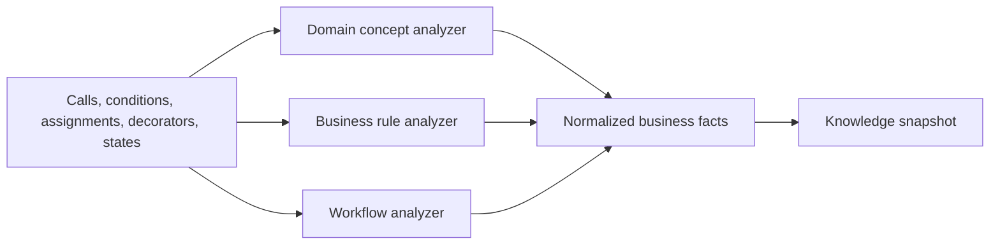

# Business Extraction Engine

## Document information

Status: Phase 4 complete
Version: 2.5
Owner: CodeMind Engineering
Architecture decision:
[ADR-014](../06-adrs/014-knowledge-analysis-architecture.md)

## Purpose

The business extraction engine converts supported technical facts into
evidence-backed domain concepts, rules, workflows, events, and state
transitions.

It helps answer questions such as:

- Where is doctor scheduling implemented?
- Which conditions prevent an appointment from being booked?
- What happens when an appointment is cancelled?
- Where is monetary rounding applied?
- Which code transitions an order from pending to paid?

The engine explains supported source behavior. It does not decide what a
business should do and does not replace domain experts.

## Architecture decision

For the first Phase 4 implementation, business extraction is an analyzer family
inside `AnalysisModule`, not a separate NestJS module.

```text
src/modules/analysis/analyzers/business/
```

This keeps technical and business analyzers on the same immutable snapshot,
source limits, fact contract, and build lifecycle. The boundary can become a
separate module later without changing the facts consumed by
`KnowledgeModule`.

## Position in the pipeline



## Responsibilities

The logical business boundary owns:

- Domain-term and bounded-context candidates
- Condition/action business-rule candidates
- Validation, calculation, permission, and constraint rules
- Workflow and workflow-step candidates
- State transitions
- Domain events and handler relationships
- Business-level fact identity, confidence, and evidence roles

It does not own:

- Phase 3 parsing or structural persistence
- Knowledge graph tables or snapshot publication
- Generated end-user documentation
- Search ranking, embeddings, or AI provider calls
- Human approval workflows
- Modification or execution of repository source

## Extraction principles

### Evidence before explanation

A business fact is publishable only when it links to supporting immutable
source evidence. A plausible name without a declaration, condition, call,
assignment, configuration, or relationship is not enough.

### Deterministic patterns first

The first analyzers use explicit, versioned patterns such as:

- A route decorator attached to a controller method
- A controller call to an unambiguous service method
- A condition guarding a throw, return, call, or assignment
- A comparison followed by a state assignment
- A calculation expression passed through a known rounding function
- An event publication paired with a reliably resolved handler

Naming conventions may increase heuristic confidence but cannot independently
create a deterministic rule.

### Preserve uncertainty

Ambiguous targets remain unresolved. Heuristic concepts and rules carry their
derivation type and confidence. The engine does not invent missing workflow
steps to make a graph look complete.

### No AI authority

AI-assisted extraction belongs to a later phase. When introduced, it produces
labeled proposals with evidence and review state. It cannot overwrite
deterministic facts.

## Initial business fact families

### Domain concepts

Examples include Doctor, Appointment, Schedule, Invoice, Payment, Enrollment,
and Repository. Candidates may come from entities, DTOs, service boundaries,
route names, validation types, and repeated symbol vocabulary.

### Business rules

Initial supported categories:

- Validation rule
- Permission rule
- State constraint
- Calculation rule
- Eligibility rule
- Scheduling rule

A normalized rule contains condition, action or outcome, subject concepts,
derivation, confidence, and evidence. Human-readable summaries are derived from
that structure and are not the primary identity.

### Workflows

A workflow contains ordered evidence-backed steps. Initial order comes from
resolved call sites and explicit state/event relationships; it is not inferred
from import order or file layout.

### States and transitions

State facts record observed values and assignments. A transition requires
evidence of an old-state condition, new-state assignment, explicit transition
call, or framework-defined state operation. Merely declaring an enum does not
prove a runtime transition.

### Events and handlers

Event relationships require an identifiable publication and handler contract.
Name similarity alone is heuristic evidence, not a deterministic link.

## Example: doctor scheduling

Suppose the indexed repository contains:

```text
DoctorController.scheduleAppointment()
    -> DoctorScheduleService.schedule()
    -> AppointmentRepository.findAvailableSlot()
```

and the service checks whether a slot is already occupied before saving.

Phase 4 should produce:

- Architectural nodes for controller, service, and repository
- A Doctor Appointment Scheduling workflow
- Ordered call edges between the workflow steps
- An Appointment Slot domain concept
- A scheduling rule describing the occupied-slot condition and outcome
- Evidence links to the route, methods, call sites, condition, and persistence
  operation

The API can then answer “where is doctor scheduling?” with source locations and
confidence instead of returning an unsupported generated explanation.

## Example: rounding logic

Rounding extraction starts from technical evidence such as:

- `Math.round`, `toFixed`, decimal-library, or framework-specific calls
- Arithmetic expressions before the rounding operation
- Assignment or return target
- Surrounding condition and containing symbol

The engine may identify that `calculateInvoiceTotal()` rounds a monetary value.
It must not claim the legal or accounting reason unless that meaning is
supported by code, configuration, documentation, or later human confirmation.

## Fact contract

Business analyzers emit the same normalized fact envelope as technical
analyzers:

- Kind and deterministic identity key
- Typed bounded properties
- Source and target fact references when applicable
- Analyzer name and version
- Derivation type and confidence
- One or more immutable source evidence records
- Diagnostics for incomplete or conflicting patterns

They do not write knowledge entities directly.

## Implemented analyzer structure

```text
src/modules/analysis/analyzers/business/
├── typescript-business.analyzer.ts
├── typescript-business-analyzer.errors.ts
├── typescript-event.analyzer.ts
├── typescript-event-analyzer.errors.ts
├── typescript-state.analyzer.ts
└── typescript-state-analyzer.errors.ts
```

The TypeScript/JavaScript business analyzer emits concept and rule facts. The
state analyzer performs its own bounded pass and emits states plus explicit
transitions. The event analyzer extracts explicit publication and handler
contracts. The repository-wide `WorkflowAnalysisService` consumes resolved
architecture output after these file-level passes. It does not parse source a
fourth time.

## Implemented state boundary

The initial state pass recognizes:

- Enum members as declared states
- Qualified enum values assigned to fields named `status` or `state`
- Simple bounded string values assigned to those fields
- A previous state only when an enclosing equality guard compares the exact
  same target, such as `appointment.status === AppointmentStatus.Pending`

An unguarded assignment still creates a transition fact with an unknown source
state, but it does not create a `transitions_to` graph edge. Inequality guards,
computed properties, nested data-flow inference, switch fall-through, and
cross-function transition composition remain unsupported rather than guessed.

## Implemented event boundary

The initial event pass recognizes:

- Literal topics passed to `emit()` or `emitAsync()`
- Matching literal-topic `@OnEvent()` method contracts
- Constructed event objects passed to `publish()`
- Constructed event arrays passed to `publishAll()`
- Type references declared by `@EventsHandler()`

Resolved publications create component-to-event `triggers` edges. Resolved
handler contracts create handler-to-event `handles` edges. Dynamic topics,
event variables, computed constructor expressions, empty handler contracts, and
unsupported `publishAll` elements are retained as unresolved facts with
diagnostics and do not become authoritative event nodes.

## Implemented workflow boundary

The workflow pass recognizes Nest HTTP method decorators as explicit entry
points. It creates an entrypoint step and then appends calls whose source symbol
is exactly the route method and whose repository-wide resolution is
unambiguous. Call-site offsets provide deterministic ordering.

The implementation enforces snapshot, per-workflow, and total-step limits.
Unresolved and ambiguous calls remain available through call-resolution facts
and workflow counts but are not converted into steps. Recursive downstream
traversal, conditional branch execution, loops, callbacks, and promise timing
remain unsupported rather than guessed.

## Implemented rule boundary

Milestone 4.5 recognizes guarded `throw`/`return` outcomes, semantically
signaled guarded calls or assignments, and explicit rounding operations. Rule
properties retain normalized identifiers, operator/kind information, the
containing Phase 3 symbol, and matched domain-concept identities. They do not
retain raw source expressions or literal values.

The following remain unsupported rather than guessed:

- Meaning inferred only from comments or arbitrary string literals
- Runtime-computed property names and reflective control flow
- Interprocedural conditions requiring data-flow execution
- Legal or accounting intent that is not represented by source structure
- Recursive or branch-sensitive workflow expansion beyond direct route calls

## Resource and security limits

Business analyzers inherit repository, source, and tenant limits from the
analysis pipeline. They also require limits for:

- Facts per file and repository
- Workflow steps and branching depth
- Graph traversal depth and visited edges
- Rule-property and summary sizes
- Analyzer runtime and diagnostic count

Repository code is never executed. Analyzer failures store sanitized messages
without source bodies, credentials, absolute paths, or stack traces intended
for clients.

## Milestone acceptance

Milestone 4.5 is complete when supported TypeScript/JavaScript fixtures produce
evidence-backed domain concepts and business rules without AI.

Milestone 4.6 is complete when supported fixtures produce bounded workflows,
events, states, and transitions with deterministic ordering where resolvable.

Both milestones require:

- Stable analyzer versions and identities
- Clear deterministic versus heuristic classification
- Idempotent knowledge publication
- Tenant isolation
- Unit and PostgreSQL integration coverage
- Documentation of unsupported and ambiguous cases

Milestone 4.9 satisfies this gate with analyzer and projector service coverage
plus a real-PostgreSQL processor/persistence suite. The suite verifies
idempotent publication input, evidence and tenant boundaries, draft exclusion,
and bounded graph persistence. Unsupported dynamic, recursive, or
branch-sensitive behavior remains explicit rather than inferred.
