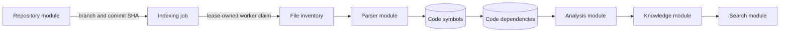
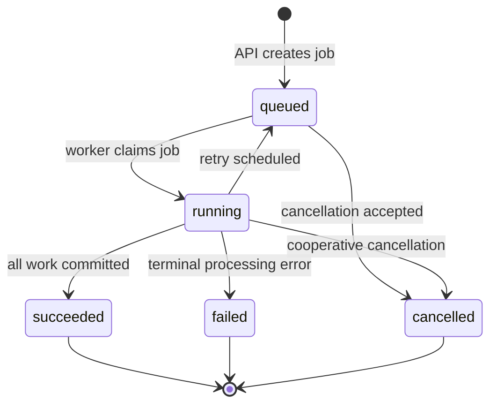

# Indexing Module

## Document information

Status: Milestones 3.1 through 3.9 implemented; tests deferred
Version: 2.5
Owner: CodeMind Engineering

## Purpose

The indexing module coordinates the durable work required to convert a
synchronized repository branch into searchable code intelligence. It sits
between repository ingestion and the parser/analysis pipeline.

Milestones 3.1 through 3.9 establish the job and persistence model, immutable
workspace boundary, file discovery, incremental hashing, language detection,
bounded parser dispatch, version-scoped symbols, the initial dependency graph,
and a durable job lifecycle. An authorized caller can queue, inspect, cancel,
and retry jobs for an active synchronized branch.

A background worker does not consume queued jobs yet. Milestone 3.9 exposes
the safe internal claim/lease contract that Milestone 3.10 will call.

## Current responsibilities

Implemented:

- Create a durable indexing job for one repository branch and commit SHA
- Derive organization and requesting-user scope from the access token
- Require both `repository.read` and `repository.index` to create a job
- Require `repository.read` to list or inspect jobs
- Reject disabled repositories, deleted branches, and unsynchronized branches
- Prevent concurrent queued/running jobs for the same branch
- Preserve a target commit snapshot even if the branch later advances
- Persist progress counters, attempts, failure details, and lifecycle times
- Capture `incremental` or `full` mode on each job
- Define stable `IndexedFile` inventory keyed by branch and normalized path
- Define immutable SHA-256/Git-blob `FileHash` versions
- Define job/file-scoped `IndexingError` records
- Prepare isolated per-job `source`, `metadata`, and `cache` directories
- Verify immutable target commits in the hardened Git object cache
- Reject workspace overlap, traversal, symlinks, and invalid identities
- Clean or reset only a validated job workspace
- Discover files directly from an immutable Git tree without checkout
- Apply centralized ignored-directory and supported-extension policies
- Enforce path, depth, file-count, file-size, and total-byte limits
- Reconcile active/deleted `IndexedFile` rows in a short transaction
- Skip unchanged Git blobs for incremental jobs
- Read changed blobs with an absolute binary-output ceiling
- Compute SHA-256 and reuse immutable content versions
- Update explicit current-hash pointers in restart-safe batches
- Detect languages through one extension registry shared with discovery
- Persist language on every active indexed file
- Separate parser-supported TS/JS files from inventory-only documents
- Read one immutable parser input at a time through `GitService`
- Enforce the configured byte ceiling, persisted size, and UTF-8 encoding
- Dispatch TS/TSX/JS/JSX through the parser module without ORM coupling
- Persist version-scoped symbols linked to immutable file hashes
- Reconcile parser retries while preserving stable symbol IDs
- Enforce job, commit, branch, file, hash, blob, and tenant ownership on writes
- Persist imports, exports, `extends`, and `implements` relationships
- Resolve deterministic relative modules and unambiguous symbol targets
- Preserve unresolved packages, aliases, and textual targets without guessing
- Reconcile dependency retries while preserving stable relationship IDs
- Paginate and filter repository job history by status
- Claim eligible jobs atomically with PostgreSQL `SKIP LOCKED`
- Enforce lease-token ownership and heartbeat expiry on worker mutations
- Track processing phase, file progress, symbols, and dependencies
- Requeue retryable failures with bounded attempts and a configurable delay
- Recover expired leases in bounded batches
- Cancel queued work immediately and running work cooperatively
- Create manual retry rows without rewriting terminal history
- Update branch indexing health only when the completed commit is still current
- Return `404` for cross-organization repository or job identifiers

Deferred to the next slices:

- Function-call resolution and advanced static analysis
- Queue transport and worker consumption
- Repository-health integration for current job state

Not owned by this module:

- Repository registration and Git synchronization
- AST and symbol parsing
- Advanced semantic analysis and function-call inference
- Embedding generation
- Search ranking
- AI response generation

## Position in the pipeline



The job records intent and progress. It does not contain source content and it
does not run Git or parser work inside an HTTP request.

## Request flow

```text
Authenticated request
    |
    v
Global JWT and permission guards
    |
    v
IndexingController
    |
    v
IndexingService
    |-- RepositoriesService: tenant ownership and lifecycle
    |-- RepositoryBranchesService: persisted branch state
    `-- IndexingRepository: job persistence
            |
            v
        PostgreSQL
```

Clients never submit `organizationId`, `requestedByUserId`, job status, or a
commit SHA. Those values come from the authenticated identity and trusted
persisted state.

## Module boundaries

| Component | Responsibility | Allowed dependencies |
|---|---|---|
| `IndexingController` | HTTP parameters, DTOs, authenticated context | `IndexingService`, shared decorators |
| `IndexingService` | Tenant checks, branch eligibility, public create/cancel/retry rules, error mapping | Repository application services, lifecycle service, `IndexingRepository` |
| `IndexingRepository` | TypeORM job queries and persistence | TypeORM and indexing entities |
| `IndexJobLifecycleService` | Worker-facing phase/progress rules, ownership enforcement, completion and failure policy | Typed indexing configuration, lifecycle repository |
| `IndexJobLifecycleRepository` | Atomic claims, leases, heartbeats, terminal transitions, recovery | TypeORM, indexing and branch entities |
| `IndexingWorkspaceService` | Validate identity, verify commit, prepare and clean isolated paths | Typed indexing configuration, `GitService`, Node filesystem APIs |
| `SourceParsingService` | Validate and read one immutable source version for parsing | Typed indexing configuration, `GitService`, `ParserService` |
| `SymbolExtractionService` | Validate normalized symbols and coordinate one file-version write | `SourceParsingService`, typed indexing configuration, `CodeSymbolsRepository` |
| `CodeSymbolsRepository` | Tenant-aware symbol reconciliation and transaction ownership checks | TypeORM and indexing entities |
| `DependencyExtractionService` | Normalize parser relationships and resolve reliable targets | Parser results, symbol persistence, relative resolver, `CodeDependenciesRepository` |
| `RelativeModuleResolverService` | Produce safe ordered candidates for relative modules | POSIX path rules only |
| `CodeDependenciesRepository` | Resolve tenant-scoped lookup data and reconcile relationships | TypeORM and indexing entities |
| Future worker service | Execute lease-owned durable jobs | Lifecycle service and scanner/parser ports |

The indexing module uses exported repository application services instead of
querying repository tables directly. Its TypeORM persistence adapter is not
exported.

## Job lifecycle



Milestone 3.9 implements these transitions through explicit lifecycle methods.
Milestone 3.10 supplies the process that repeatedly claims and executes work;
workers must never update job entities directly.

Lifecycle status is intentionally separate from processing phase:

```text
queued -> preparing -> discovering -> hashing -> analyzing -> finalizing -> finished
```

Only a private lease token can advance a running job. A heartbeat renews the
lease and reports whether cooperative cancellation was requested.

## Creation rules

A job can be queued only when all rules pass:

1. The repository exists in the authenticated organization.
2. The repository status is `active`.
3. The supplied branch belongs to that repository.
4. The branch status is `active`.
5. The branch has a persisted commit SHA from synchronization.
6. No job for the same repository branch is currently `queued` or `running`.

The service performs an early active-job check for a useful error. A partial
unique database index enforces the same rule under concurrent requests.

## Commit snapshot semantics

`targetCommitSha` is copied from the synchronized branch when the job is
created:

```text
branch.commitSha = A
        |
        `-- create job(targetCommitSha = A)

branch later moves to B
        |
        `-- existing job still processes A
```

This makes a job reproducible. The worker must use `targetCommitSha`, not the
branch's current SHA. A later request may queue a new job for commit B after
the first job reaches a terminal state.

## Authorization and tenant isolation

| Operation | Permissions |
|---|---|
| Queue a job | `repository.read`, `repository.index` |
| List repository jobs | `repository.read` |
| Get one repository job | `repository.read` |
| Cancel a job | `repository.read`, `repository.index` |
| Retry a job | `repository.read`, `repository.index` |

Permissions come from organization roles. Tenant isolation is also enforced
at the data-access boundary:

- Repository validation includes `organizationId`.
- Job lists include `organizationId` and `repositoryId`.
- Job detail lookup includes `organizationId`, `repositoryId`, and `jobId`.
- Cross-organization identifiers return the same `404` as missing records.

## Progress model

Each job stores:

- `totalFiles`: files selected for this run
- `processedFiles`: files processed successfully
- `skippedFiles`: files intentionally omitted or unchanged
- `failedFiles`: files that failed processing
- `processedSymbols`: normalized symbols persisted
- `processedDependencies`: normalized relationships persisted
- `attemptCount`: worker attempts
- `maxAttempts`: terminal retry ceiling

Database checks require non-negative values and ensure processed, skipped, and
failed files never exceed the total. Counters remain zero until a worker owns
the job, and absolute progress snapshots cannot move backwards in an attempt.

## Language detection

Language detection is deterministic and extension-based in Milestone 3.5:

| Extensions | Persisted language | Capability |
|---|---|---|
| `.ts`, `.tsx` | `typescript` | Parser supported |
| `.js`, `.jsx` | `javascript` | Parser supported |
| `.json` | `json` | Inventory only |
| `.md` | `markdown` | Inventory only |
| `.yaml`, `.yml` | `yaml` | Inventory only |

The discovery service derives its supported-extension set from the same
registry used by `LanguageDetectionService`. Adding a new extension therefore
requires one registry change instead of coordinating duplicated allow lists.
The file extension remains stored separately so the parser can distinguish
TSX/JSX syntax while using the broader TypeScript/JavaScript language family.

## Error behavior

| Condition | HTTP result |
|---|---:|
| Missing or foreign repository | `404` |
| Missing branch in repository | `404` |
| Missing or foreign job | `404` |
| Disabled repository | `409` |
| Deleted branch | `409` |
| Branch has no synchronized commit | `409` |
| Active job already exists | `409` |
| Missing authentication | `401` |
| Missing permission | `403` |

Database and worker internals are not included in API error responses.

## Module structure

```text
src/modules/indexing/
├── content/
│   ├── content-hash.errors.ts
│   ├── content-hash.service.ts
│   └── content-hash.types.ts
├── dependencies/
│   ├── code-dependencies.repository.ts
│   ├── dependency-extraction.errors.ts
│   ├── dependency-extraction.service.ts
│   ├── dependency-extraction.types.ts
│   └── relative-module-resolver.service.ts
├── discovery/
│   ├── file-discovery.constants.ts
│   ├── file-discovery.errors.ts
│   ├── file-discovery.service.ts
│   └── file-discovery.types.ts
├── dto/
│   ├── index-status.dto.ts
│   ├── list-index-jobs-query.dto.ts
│   └── start-index.dto.ts
├── entities/
│   ├── code-dependency.entity.ts
│   ├── code-symbol.entity.ts
│   ├── file-hash.entity.ts
│   ├── index-job.entity.ts
│   ├── indexed-file.entity.ts
│   └── indexing-error.entity.ts
├── enums/
│   ├── code-dependency-kind.enum.ts
│   ├── code-symbol-kind.enum.ts
│   ├── code-symbol-visibility.enum.ts
│   ├── file-hash-algorithm.enum.ts
│   ├── index-job-status.enum.ts
│   ├── index-job-phase.enum.ts
│   ├── index-job-trigger.enum.ts
│   ├── indexed-file-status.enum.ts
│   ├── indexing-error-phase.enum.ts
│   ├── indexing-mode.enum.ts
│   ├── language-capability.enum.ts
│   └── source-language.enum.ts
├── language/
│   ├── language-detection.errors.ts
│   ├── language-detection.service.ts
│   ├── language-detection.types.ts
│   └── language-registry.constants.ts
├── lifecycle/
│   ├── index-job-lifecycle.repository.ts
│   ├── index-job-lifecycle.service.ts
│   └── index-job-lifecycle.types.ts
├── indexing.controller.ts
├── file-inventory.service.ts
├── indexing.module.ts
├── indexing.repository.ts
├── indexing.service.spec.ts
├── indexing.service.ts
├── parsing/
│   ├── source-parsing.errors.ts
│   ├── source-parsing.service.ts
│   └── source-parsing.types.ts
├── symbols/
│   ├── code-symbols.repository.ts
│   ├── symbol-extraction.errors.ts
│   ├── symbol-extraction.service.ts
│   └── symbol-extraction.types.ts
└── workspace/
    ├── indexing-workspace.errors.ts
    ├── indexing-workspace.service.ts
    └── indexing-workspace.types.ts
```

## Verification

The service unit suite covers successful job creation, disabled repositories,
unknown/deleted/unsynchronized branches, active-job conflicts, concurrent
database uniqueness races, tenant-scoped lists, and hidden cross-tenant job
identifiers.

The migration and entity metadata must also pass TypeORM schema-drift checks.
New Phase 3 scanner, hash, language, parser, symbol, and dependency tests remain
explicitly deferred until the planned phase-level test slice.

## Next implementation slice

Milestone 3.10 adds the background worker that invokes the lifecycle contract,
prepares the immutable workspace, scans and hashes files, parses supported
content, persists symbols/dependencies, heartbeats between bounded batches,
and commits the terminal state. PostgreSQL remains authoritative; BullMQ or
Redis can be added later as a delivery notification layer.
