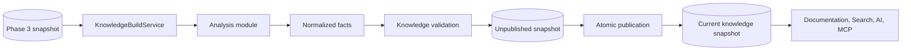
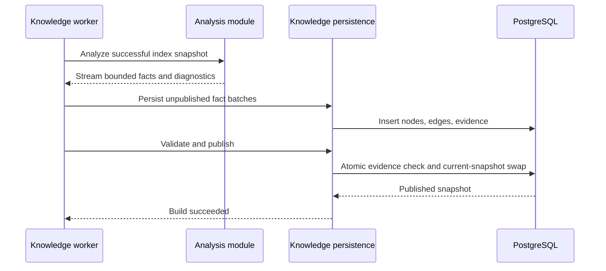
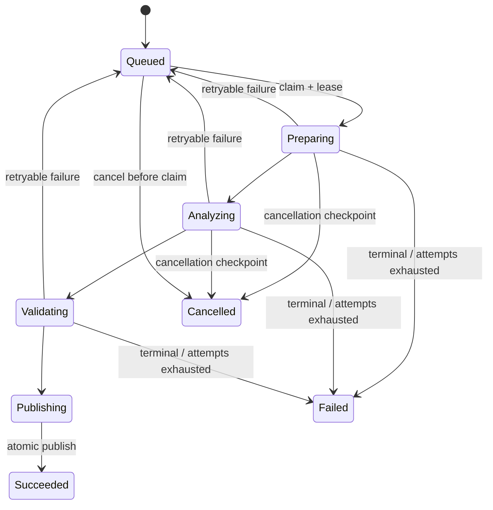

# Knowledge Module

## Document information

Status: Milestone 4.8 background processing complete
Version: 2.7
Owner: CodeMind Engineering
Architecture decision:
[ADR-014](../06-adrs/014-knowledge-analysis-architecture.md)
Database proposal:
[Knowledge graph schema](../03-database/knowledge-graph-schema.md)

## Purpose

The knowledge module turns normalized analysis facts into a durable,
tenant-scoped, evidence-backed product view of a repository.

It provides the stable boundary consumed later by documentation, search, AI,
and MCP. It does not replace Phase 3 structural metadata and does not treat
generated prose as authoritative knowledge.

## Knowledge model

CodeMind represents knowledge as:

```text
Immutable snapshot
    |
    +-- typed nodes
    |
    +-- typed directed edges
    |
    +-- source evidence
    |
    `-- derivation and confidence
```

Examples of nodes:

- `DoctorController` classified as an architectural controller
- `DoctorScheduleService` classified as a service
- `DoctorSchedule` identified as a domain concept
- “A cancelled appointment releases its slot” represented as a business rule
- “Book doctor appointment” represented as a workflow

Examples of edges:

- Controller `calls` service
- Service `depends_on` repository
- Code component `represents` domain concept
- Rule `enforces` workflow step
- Event `triggers` state transition

Every example must link to immutable file/hash/symbol/range evidence before it
can be published.

## Position in the pipeline



## Current implementation state

The `KnowledgeModule` owns migration-backed build, snapshot, node, edge,
evidence, evidence-link, and build-error entities. Its internal persistence
service creates a build and invisible draft atomically, writes retry-safe graph
batches, validates evidence completeness, and publishes a snapshot atomically.

Database constraints and triggers validate Phase 3 source scope and protect
published graph content from mutation. A published snapshot becomes current
only when its repository branch still points to the build's target commit.

Milestones 4.4 and 4.5 provide internal projectors for architecture components,
relationships, domain concepts, and business rules. Repeated domain evidence
is merged deterministically, while containing components are linked to concepts
with `represents` and rules with `enforces`.

The first Milestone 4.6 projector adds state and state-transition nodes. A
`transitions_to` edge is published only when both states are supported by
evidence; unknown-source assignments remain visible transition nodes without a
fabricated source edge.

The event projector adds domain-event and event-handler nodes. Publication call
evidence creates `triggers` edges from containing components, while resolved
decorator contracts create `handles` edges from handlers. Dynamic references
remain analysis output and are not promoted to domain-event nodes.

The workflow projector adds workflow and ordered workflow-step nodes. A
controller `contains` its route workflow, the workflow `contains` each step,
adjacent steps are connected with `precedes`, and resolved call steps `call`
their target architecture components.

Milestone 4.8 connects all projectors to a PostgreSQL-backed worker. The HTTP
API creates a queued build from one successful index job and returns
immediately. A worker claims the build with a renewable lease, runs the bounded
analysis graph assembler, stores diagnostics, persists retry-safe node and edge
batches, validates the draft, and publishes it atomically. Automatic retries,
cooperative cancellation, expired-lease recovery, and graceful shutdown share
the same durable lifecycle.

## Responsibilities

The knowledge module owns:

- Durable knowledge-build creation and status
- Background claim, lease, retry, cancellation, and recovery rules
- Snapshot identity and current-snapshot selection
- Validation of normalized analysis facts
- Node, edge, evidence, and derivation persistence
- Atomic snapshot publication
- Tenant-scoped graph and evidence queries
- Future human review state

It does not own:

- Git synchronization or raw source storage
- Phase 3 file, hash, symbol, or dependency persistence
- Language/compiler AST traversal
- Search ranking or embeddings
- AI provider calls or conversation memory
- Documentation rendering

## Snapshot identity

Every build targets exactly one successful Phase 3 index job. Its knowledge
snapshot records:

- Organization, repository, and branch
- Source index-job ID
- Immutable target commit SHA
- Analyzer bundle version
- Semantic configuration digest
- Publication and supersession timestamps

Snapshots are immutable. Re-running analyzers with different code or
configuration creates another snapshot. Only one published snapshot may be
current for a branch.

If a branch advances while a build is running, the resulting snapshot remains
valid for its target commit. It becomes current only when the branch still
points to that commit at publication time.

## Publication lifecycle



Readers filter to published snapshots. They never observe partially persisted
graphs.

## Worker lifecycle



Claims use `FOR UPDATE SKIP LOCKED`, allowing multiple application processes to
consume the same durable queue without claiming one build twice. Heartbeats
extend the lease. Recovery requeues an expired lease while attempts remain and
otherwise marks the build failed. The worker stops claiming on shutdown and
turns work interrupted at a checkpoint into a retryable transition.

## Evidence requirements

A published node or edge has at least one evidence link. Evidence identifies:

- Indexed file
- Immutable file hash
- Code symbol when applicable
- Exact source range when applicable
- Evidence role such as declaration, call, condition, assignment, or
  configuration

Evidence does not copy source text. A future authorized source endpoint may
resolve a bounded excerpt from the snapshot commit.

Persistence validates that evidence belongs to the snapshot organization,
repository, branch, index job, and commit. Cross-snapshot evidence is rejected.

## Node and edge identity

Database IDs are auto-increment integers local to one persisted snapshot.
Cross-snapshot comparison uses:

- Fact kind
- Deterministic identity key
- Normalized content fingerprint
- Analyzer name and version

The identity key answers “is this the same conceptual fact?” The content
fingerprint answers “did its normalized meaning change?” Neither is supplied by
an API client.

## Confidence and review

Each node and edge records derivation type and confidence:

- Deterministic
- Heuristic
- AI-assisted in a later phase
- Human-confirmed in a later review workflow

Confidence is not permission to hide uncertainty. APIs return derivation type,
confidence, snapshot commit, and evidence summaries with inferred knowledge.

Rejected or corrected knowledge will be preserved as review history rather
than silently rewriting the source snapshot.

## PostgreSQL-first storage

The first graph uses PostgreSQL adjacency tables with indexed source/target
node IDs and bounded recursive CTE traversal.

PostgreSQL is selected because it already provides:

- Tenant-aware transactions
- Migration and backup infrastructure
- Atomic snapshot publication
- Strong foreign keys to Phase 3 evidence
- Sufficient traversal for the first bounded repository queries

Neo4j remains a measured future option. Vector indexes belong to Phase 5 search
and will be derived projections, not the authoritative graph.

## Public API

The implemented read API is repository and snapshot scoped. Product-level
resources include:

- Current knowledge snapshot
- Architecture components and relationships
- Domain concepts
- Business rules
- Workflows and steps
- States, transitions, events, and handlers
- Evidence summaries

The API does not provide generic CRUD for `knowledge_nodes` or
`knowledge_edges`. Facts are generated from source snapshots and updated by
rebuilding, not by arbitrary row mutation.

Cross-organization identifiers return `404`. Read access requires
`repository.read`. List endpoints are bounded to 100 records; node and edge
detail endpoints return immutable file/hash/symbol/range evidence summaries,
never raw source.

The full contract is documented in
[Knowledge API](../04-api/knowledge-api.md).

## Module structure

```text
src/modules/knowledge/
├── dto/
├── entities/
├── enums/
├── persistence/
├── repositories/
├── services/
├── knowledge.controller.ts
└── knowledge.module.ts
```

Exact files follow the implemented use cases; this is not permission to create
empty placeholders.

## Milestone boundaries

Milestone 4.2 defines and implements read ports and analyzer facts without
persistence.

Milestone 4.3 implemented:

- Knowledge builds and lifecycle
- Immutable snapshots
- Nodes and edges
- Evidence and evidence links
- Build errors
- Entities, constraints, indexes, and migrations
- Atomic publication and current-snapshot behavior

Milestones 4.4–4.6 add architecture, domain, rule, state, transition, event, and
workflow extraction plus projection. Milestone 4.7 adds published snapshot,
node, relationship, and evidence queries. Later milestones add full background
processing.

## Completion gate

The knowledge foundation is complete only when:

- A successful index job can produce one immutable knowledge snapshot.
- Every published node and edge has valid Phase 3 evidence.
- Partial builds are invisible.
- Current-snapshot publication is safe when branches move or builds race.
- Cross-tenant reads and writes are impossible at service and query boundaries.
- Migrations produce no TypeORM schema drift.
- Unit and PostgreSQL integration tests cover publication and evidence rules.
