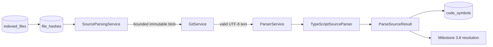

# Parser Module

## Document information

Status: Milestone 3.7 symbol persistence integrated; tests deferred
Version: 2.1
Owner: CodeMind Engineering

## Purpose

The parser module converts bounded TypeScript and JavaScript source text into
plain, normalized code metadata. It understands syntax; it does not execute
repository code, query PostgreSQL, or decide how parsed metadata is stored.

Its output is the stable boundary consumed by later symbol, dependency,
analysis, knowledge, search, and AI modules.

## Current scope

Implemented in Milestone 3.6:

- A language-specific `SourceParser` contract
- A `ParserService` registry and routing boundary
- A TypeScript Compiler API adapter for `.ts`, `.tsx`, `.js`, and `.jsx`
- Normalized symbols, imports, exports, ranges, and syntax diagnostics
- Stable indexed-file and file-hash identities on every parse result
- An indexing bridge that reads one bounded immutable Git blob at a time
- UTF-8 validation before source enters a parser
- No TypeORM, Git, HTTP, or source-execution concerns inside parser adapters
- Version-scoped symbol persistence through an indexing-owned adapter

Deferred:

- Resolving imports and building dependencies in Milestone 3.8
- Background orchestration, retries, and failure thresholds in Milestone 3.10
- Additional language adapters
- Phase-level parser tests, as explicitly deferred for the current development
  sequence

## Architecture boundary



The dependency direction is intentional:

```text
Indexing module -> Parser module
Parser module   -X-> Indexing, repositories, TypeORM, HTTP
```

`SourceParsingService` belongs to indexing because it joins persisted indexing
identity, the immutable Git snapshot, and the parser port. `ParserService`
belongs to parser because it selects a syntax adapter.

## Module structure

```text
src/modules/parser/
├── adapters/
│   └── typescript-source.parser.ts
├── enums/
│   ├── parsed-export-kind.enum.ts
│   ├── parsed-symbol-kind.enum.ts
│   ├── parsed-symbol-visibility.enum.ts
│   └── parser-diagnostic-category.enum.ts
├── interfaces/
│   └── source-parser.interface.ts
├── types/
│   └── parser.types.ts
├── parser.errors.ts
├── parser.module.ts
└── parser.service.ts
```

The indexing-side source bridge is separate:

```text
src/modules/indexing/parsing/
├── source-parsing.errors.ts
├── source-parsing.service.ts
└── source-parsing.types.ts
```

## Parser contract

Every language adapter implements:

```typescript
interface SourceParser {
  supports(
    input: Pick<ParseSourceInput, 'language' | 'extension'>,
  ): boolean;

  parse(input: ParseSourceInput): Promise<ParseSourceResult>;
}
```

`ParseSourceInput` carries:

- `indexedFileId`: stable branch/path identity
- `fileHashId`: immutable content-version identity
- `path`: normalized repository-relative path
- `language`: centralized detected language
- `extension`: dialect selector such as `tsx` or `jsx`
- `content`: bounded UTF-8 source text

`ParseSourceResult` carries the same identities plus normalized symbols,
imports, exports, diagnostics, and `hasSyntaxErrors`. It never contains a
TypeScript compiler node or TypeORM entity.

## Adapter selection

`ParserService` owns a registry of `SourceParser` implementations. It asks each
adapter whether it supports the detected language and stored extension, then
dispatches the file to the first match.

Current mapping:

| Language | Extensions | Script mode |
|---|---|---|
| `typescript` | `ts` | TypeScript |
| `typescript` | `tsx` | TypeScript with JSX |
| `javascript` | `js` | JavaScript |
| `javascript` | `jsx` | JavaScript with JSX |

An unsupported language/extension pair produces the stable
`unsupported_language` parser error. JSON, Markdown, and YAML remain valid
inventory formats, but are not sent to a parser.

## Normalized symbols

The first adapter extracts:

- Classes
- Interfaces
- Named function declarations
- Arrow functions and function expressions assigned to named variables
- Methods, method signatures, constructors, getters, and setters
- Enums
- Type aliases

Each symbol includes:

- Name
- Qualified name based on containing declarations
- Normalized kind
- Public, protected, private, or non-applicable visibility
- Export and default-export flags
- Bounded declaration signature
- Bounded JSDoc summary when present
- One-based start/end line and column plus zero-based source offsets

Imports capture module specifier, default import, namespace import, named
bindings, aliases, and type-only state. Exports capture declarations, named
exports, namespace exports, star exports, default exports, and export
assignments.

Milestone 3.7 persists these declaration facts against an immutable file hash.
Inheritance, calls, and resolved target identities remain later metadata and
analysis work.

## Diagnostics

The adapter creates a single-file TypeScript program with resolution, library
loading, type checking, and emission disabled. Only syntactic diagnostics are
normalized.

Each diagnostic includes:

- Compiler diagnostic code
- `warning`, `error`, `suggestion`, or `message` category
- Flattened message text
- Source range when the compiler supplies one

A malformed file can still return partial syntax metadata together with
`hasSyntaxErrors: true`. The future worker decides whether a per-file error
counts toward a repository-level failure threshold.

## Source safety and resource limits

Repository source is untrusted. Parsing follows these rules:

1. A caller supplies trusted persisted file/version metadata, not an arbitrary
   filesystem path.
2. `GitService` reads the blob from the job's immutable target commit.
3. Binary output is capped by `INDEXING_MAX_FILE_SIZE_BYTES`.
4. The blob byte length must match persisted file-hash metadata.
5. The blob must be valid UTF-8.
6. Only one blob is retained by `SourceParsingService` for one parse call.
7. The compiler parses syntax only; it does not resolve modules, emit code,
   load project configuration, execute hooks, or run repository programs.
8. Source content is not stored in errors or parser results.

The configured default per-file limit is 2 MiB. Discovery and hashing enforce
the same limit before parsing. `INDEXING_MAX_SYMBOLS_PER_FILE` additionally
caps normalized symbols from one file; its default is 10,000.

## Error ownership

| Error | Owner | Meaning |
|---|---|---|
| `invalid_metadata` | Indexing source bridge | Persisted parse identity or size is invalid |
| `blob_size_mismatch` | Indexing source bridge | Git bytes disagree with persisted content metadata |
| `unsupported_encoding` | Indexing source bridge | Blob is not valid UTF-8 |
| `unsupported_language` | Parser module | No adapter supports the language/extension pair |
| `invalid_input` | Parser adapter | Parser identity, path, or content contract is invalid |

Operational exceptions are converted into sanitized `indexing_errors` by the
future worker. Raw source and compiler AST data must never be included in API
error responses.

## Adding another language

Adding a parser requires:

1. Add the language/extension capability to the centralized indexing language
   registry.
2. Implement `SourceParser` inside the parser module.
3. Convert library-specific nodes into existing or intentionally extended
   CodeMind parser types.
4. Register the adapter in `ParserService`.
5. Keep filesystem, database, and orchestration logic outside the adapter.
6. Add adapter and cross-boundary tests before declaring that language
   supported.

Tree-sitter or a language-native parser may be used internally for future
languages. Its node types must not leak through `ParseSourceResult`.

## Persistence integration

`SymbolExtractionService` maps parser-owned kinds and visibility into the
indexing persistence model. `CodeSymbolsRepository` reconciles one immutable
file version in bounded batches. Matching symbols retain their auto-increment
IDs, new symbols are inserted, and stale output is removed atomically.

The write is accepted only while the same running job owns the organization,
repository, branch, target commit, current file hash, Git blob, and byte size.
This prevents stale parsing work from replacing newer metadata.

## Next milestone

Milestone 3.8 will consume normalized imports, exports, and declaration
relationships to create version-scoped dependencies without coupling compiler
internals to database entities.
