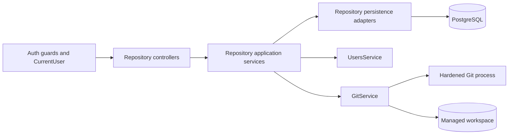

# Repository Module

## Document information

Status: Phase 2 repository module complete
Version: 3.0
Owner: CodeMind Engineering

## Purpose

The repository module owns the software repositories registered with
CodeMind. It establishes the organization boundary and stable repository
identity required by future cloning, indexing, parsing, analysis, search, and
knowledge features.

Registering a repository stores metadata only. An authorized caller can later
start explicit branch synchronization; source indexing does not start yet.

## Responsibilities

Implemented:

- Register a credential-free HTTPS Git repository
- Detect GitHub, GitLab, Bitbucket, or generic HTTPS providers
- Prevent duplicate remote URLs inside one organization
- List and filter organization repositories
- Retrieve one organization repository
- Update display name, default branch, and active/disabled status
- Delete an organization repository
- Preserve the creating user when available
- Add, list, and remove organization-user repository memberships
- Enforce membership management through `repository.member.manage`
- Persist branch names, commit SHAs, lifecycle status, and index timestamps
- Validate GitHub HTTPS and allow-listed local Git sources
- Clone without checkout and fetch branch updates in isolated workspaces
- Detect default branches, commit SHAs, and remote branch state
- List persisted branch state inside the authenticated organization
- Clone or fetch on an explicit, rate-limited synchronization request
- Atomically activate observed branches and mark missing branches as deleted
- Preserve `lastIndexedAt` while Git state changes
- Coalesce concurrent sync requests for one repository in one API process
- Record successful and failed synchronization attempts durably
- Measure and persist Git object-storage size after successful synchronization
- Report synchronization, indexing, branch, and storage health without Git I/O
- Return `404` for cross-organization IDs

Deferred to later phases:

- Git credential references
- File inventory and content hashes
- Incremental indexing

Not owned by this module:

- AST parsing
- Static analysis
- Embeddings
- Knowledge extraction
- AI answers

## Request flow

```text
Authenticated request
    |
    v
Global JWT and permission guards
    |
    v
RepositoriesController / RepositoryMembersController / RepositoryBranchesController / RepositoryStatusController
    |
    v
RepositoriesService / RepositoryMembersService / RepositoryBranchesService / RepositoryStatusService
    |
    v
RepositoriesRepository / RepositoryMembersRepository / RepositoryBranchesRepository
    |
    v
PostgreSQL
```

Controllers obtain `organizationId` and the creating user ID from
`CurrentUser`. Clients never submit an organization ID.

## Module boundaries and dependencies



| Component | Owns | May depend on |
|---|---|---|
| Controllers | HTTP parsing, authenticated context, response status | Repository services, shared decorators and guards |
| Services | Use-case orchestration, tenant checks, lifecycle rules, error mapping | Repository adapters, `UsersService`, `GitService`, `DataSource` for transactions |
| Repository adapters | TypeORM queries and persistence | Repository entities and TypeORM only |
| `GitService` | Source policy, workspace identity, clone/fetch inspection | `GitCommandService`, validated Git configuration |
| `GitCommandService` | Bounded non-shell Git process execution | Node process APIs and validated limits |

`RepositoriesModule` imports `UsersModule`, Git configuration, and TypeORM
feature repositories. It exports application services and `GitService`, but it
does not export its TypeORM repository adapters. Other modules should call a
repository application service instead of querying these tables directly.

The module may reference organization and user entities for ORM relationship
metadata. Business operations involving users go through `UsersService`; this
keeps database relationship metadata separate from capability ownership.

## Authorization model

Every endpoint is protected by the global JWT guard. Permission decorators add
the following default-role behavior:

| Capability | OWNER | ADMIN | DEVELOPER | VIEWER |
|---|:---:|:---:|:---:|:---:|
| Read/list/status/branches | Yes | Yes | Yes | Yes |
| Register/update repository | Yes | Yes | Yes | No |
| Delete repository | Yes | Yes | No | No |
| Manage repository members | Yes | Yes | No | No |
| Synchronize branches | Yes | Yes | Yes | No |

This table describes seeded roles, not hard-coded role-name checks. The guards
authorize permission names, so custom roles can express the same capabilities.
All resource queries also include the authenticated organization ID. A valid
ID from another organization is intentionally indistinguishable from a missing
ID and returns `404`.

Repository membership records do not yet filter read access. At this stage,
`repository.read` grants access to all repositories in the authenticated
organization. Membership is persisted now so a future policy can narrow
repository visibility without redesigning the data model.

## Domain model

### `RepositoryEntity`

| Field | Type | Purpose |
|---|---|---|
| `id` | Auto-increment integer | Stable repository identity |
| `organizationId` | UUID | Mandatory tenant boundary |
| `createdByUserId` | UUID or null | User that registered the repository |
| `name` | varchar(160) | Organization-facing display name |
| `provider` | enum | `github`, `gitlab`, `bitbucket`, or `generic` |
| `remoteUrl` | varchar(2048) | Normalized credential-free HTTPS Git URL |
| `defaultBranch` | varchar(255) or null | Configured branch, if known |
| `status` | enum | `active` or `disabled` |
| `lastSyncStatus` | enum | `never`, `succeeded`, or `failed` |
| `lastSyncAttemptedAt` | timestamptz or null | Most recent completed sync attempt start |
| `lastSyncedAt` | timestamptz or null | Most recent successful sync completion |
| `repositorySizeBytes` | bigint or null | Git object-storage size after the last success |
| `createdAt` | timestamptz | Creation time |
| `updatedAt` | timestamptz | Last metadata change |

### `RepositoryMemberEntity`

| Field | Type | Purpose |
|---|---|---|
| `id` | Auto-increment integer | Membership identity |
| `repositoryId` | Integer | Repository receiving the access grant |
| `userId` | UUID | User receiving access |
| `addedByUserId` | UUID or null | User that created the grant |
| `createdAt` | timestamptz | Grant creation time |

### `RepositoryBranchEntity`

| Field | Type | Purpose |
|---|---|---|
| `id` | Auto-increment integer | Branch identity |
| `repositoryId` | Integer | Parent repository |
| `name` | varchar(255) | Full branch name |
| `commitSha` | varchar(64) or null | Last observed Git object ID |
| `status` | enum | `active` or `deleted` |
| `lastIndexedAt` | timestamptz or null | Last successful indexing time |
| `createdAt` | timestamptz | First observation time |
| `updatedAt` | timestamptz | Last metadata update |

### Constraints

- `UNIQUE (organization_id, remote_url)`
- `UNIQUE (repository_id, user_id)` for memberships
- `UNIQUE (repository_id, name)` for branches
- Organization foreign key uses `ON DELETE RESTRICT`
- Creating-user foreign key uses `ON DELETE SET NULL`
- Repository deletion cascades to memberships and branches
- Organization, status, and creation time are indexed for tenant lists
- Organization and synchronization status are indexed for health operations

The same remote URL may be registered in different organizations because each
tenant owns its own future index and knowledge.

See
[Repository Data Model](../03-database/repository-model.md)
for the complete field definitions, deletion behavior, and ER diagram.

## URL policy

Registration accepts only HTTPS URLs that:

- Include a host and repository path
- Do not contain a username or password
- Do not contain query parameters or fragments
- Fit within 2,048 characters

URLs are normalized before uniqueness checks. Trailing slashes and default
HTTPS ports are removed by the URL parser. Repository URLs are immutable after
creation. Changing a remote source requires deleting and registering a new
repository identity.

This validation prevents credentials from being persisted. The internal Git
service initially permits outbound operations only for exact `github.com`
HTTPS URLs. Although registration recognizes other provider metadata, GitLab,
Bitbucket, generic HTTPS, and private credentials remain unsupported until
explicit provider and credential-reference policies are implemented.

The internal Git boundary also supports absolute local repositories contained
by `GIT_LOCAL_REPOSITORIES_ROOT`. This is an infrastructure capability for
controlled deployments; the public create DTO accepts HTTPS URLs only and does
not currently expose local repository registration.

## Git service and synchronization

`GitService` remains an internal infrastructure capability. The branch service
exposes its safe synchronization workflow through a protected endpoint. Git
supports:

- Source validation without shell interpolation
- Credential-free GitHub HTTPS repositories
- Local repositories contained by `GIT_LOCAL_REPOSITORIES_ROOT`
- Clone into `<workspaceRoot>/<organizationId>/<repositoryId>`
- Fetch/prune of remote branches
- Default branch, head commit, and remote branch discovery
- Git object-storage measurement through `git count-objects`

Git commands run through `execFile` with argument arrays. Global and system
Git configuration, credential helpers, terminal prompts, hooks, SSH, HTTP,
the Git protocol, and external protocol helpers are disabled. A validated
local source enables the file protocol only for that operation.

Clones use `--no-checkout` and never execute repository code. A temporary
directory is atomically renamed after a successful clone and safely removed
after failure. Command timeout, output size, clone depth, workspace root, and
the optional local-source root are environment controlled.

The first synchronization clones the remote; later requests fetch and prune
remote refs. Same-repository requests share one in-flight operation inside a
single Node.js process. Database persistence then locks the tenant-scoped
repository row and updates its default branch and all branch lifecycle changes
in one transaction. The Git operation intentionally occurs before the short
database transaction.

A successful synchronization records its attempted and completion timestamps,
`succeeded` status, and Git object-storage size. A failed Git operation records
`failed` and the new attempt timestamp while preserving the last successful
timestamp and size.

## Transaction and concurrency boundaries

| Operation | Boundary |
|---|---|
| Register/update/delete repository | One tenant-scoped repository write; database constraints resolve races |
| Add/remove member | Tenant and user checks followed by one membership write; unique membership constraint resolves duplicate races |
| Synchronize Git | Git clone/fetch occurs before the database transaction |
| Persist successful sync | Repository row lock, health update, and branch reconciliation in one transaction |
| Persist failed sync | Short transaction locks the repository and records failed status/attempt time |
| Read status | PostgreSQL-only repository read plus branch aggregate |

The long-running Git operation is deliberately outside the database
transaction. This prevents connections and row locks from being held during
network and filesystem work. Persistence rechecks and locks the tenant-scoped
repository before committing results, so a repository deleted or disabled
during Git work cannot be updated incorrectly.

Within one API process, concurrent sync requests for the same
`organizationId:repositoryId` share a promise. Multi-process deployments will
require a distributed job or lock in the indexing phase; the in-memory map is
not a cross-instance guarantee.

## Runtime configuration

| Variable | Default | Purpose |
|---|---:|---|
| `GIT_WORKSPACE_ROOT` | `.codemind/repositories` | Root for isolated managed clones |
| `GIT_LOCAL_REPOSITORIES_ROOT` | unset | Optional allow-list root for internal local sources |
| `GIT_COMMAND_TIMEOUT_MS` | `120000` | Per-command timeout |
| `GIT_MAX_OUTPUT_BYTES` | `1048576` | Maximum buffered stdout/stderr |
| `GIT_CLONE_DEPTH` | `1` | Shallow clone/fetch depth; `0` disables depth limiting |
| `REPOSITORY_SYNC_RATE_LIMIT_TTL_MS` | `60000` | Synchronization rate-limit window |
| `REPOSITORY_SYNC_RATE_LIMIT` | `5` | Requests allowed per window and tracker key |

The workspace path is derived only from validated organization and repository
IDs. API clients cannot provide or override it.

## API contract

Base path:

```text
/api/v1/repositories
```

| Method | Path | Permission | Purpose |
|---|---|---|---|
| `POST` | `/repositories` | `repository.create` | Register repository metadata |
| `GET` | `/repositories` | `repository.read` | List organization repositories |
| `GET` | `/repositories/:repositoryId` | `repository.read` | Retrieve one repository |
| `PATCH` | `/repositories/:repositoryId` | `repository.create` | Update mutable metadata |
| `DELETE` | `/repositories/:repositoryId` | `repository.delete` | Delete repository |
| `POST` | `/repositories/:repositoryId/members` | `repository.read`, `repository.member.manage` | Add member |
| `GET` | `/repositories/:repositoryId/members` | `repository.read` | List members |
| `DELETE` | `/repositories/:repositoryId/members/:userId` | `repository.read`, `repository.member.manage` | Remove member |
| `GET` | `/repositories/:repositoryId/branches` | `repository.read` | List persisted branches |
| `POST` | `/repositories/:repositoryId/branches/sync` | `repository.read`, `repository.index` | Clone/fetch and persist branches |
| `GET` | `/repositories/:repositoryId/status` | `repository.read` | Read repository health |

### Register

```json
{
  "name": "CodeMind API",
  "remoteUrl": "https://github.com/codemind/codemind-api.git",
  "defaultBranch": "main"
}
```

`defaultBranch` is optional. The provider is derived from the URL hostname and
cannot be supplied by the client.

Successful response:

```json
{
  "id": 101,
  "name": "CodeMind API",
  "provider": "github",
  "remoteUrl": "https://github.com/codemind/codemind-api.git",
  "defaultBranch": "main",
  "status": "active",
  "createdAt": "2026-07-31T10:00:00.000Z",
  "updatedAt": "2026-07-31T10:00:00.000Z"
}
```

Duplicate registration inside the organization returns HTTP `409`.

### List

Optional query parameters:

- `page`, default `1`
- `limit`, default `20`, maximum `100`
- `search`, matched against name and remote URL
- `provider`, one of the supported providers
- `status`, `active` or `disabled`

### Update

At least one mutable field is required:

```json
{
  "name": "CodeMind Backend",
  "defaultBranch": "develop",
  "status": "disabled"
}
```

The remote URL and organization cannot be changed.

### Delete

Successful deletion returns HTTP `204`. An unknown or cross-organization ID
returns HTTP `404`.

### Membership

Add an organization user:

```json
{
  "userId": "25d8bd53-047b-42d8-9efa-4ecedfe422d3"
}
```

Successful response:

```json
{
  "id": 201,
  "user": {
    "id": "25d8bd53-047b-42d8-9efa-4ecedfe422d3",
    "email": "developer@example.com",
    "name": "Developer",
    "status": "active",
    "roles": ["DEVELOPER"]
  },
  "addedByUserId": "b916fed6-c0e1-4537-9dab-4fe9b40c0333",
  "createdAt": "2026-07-31T12:00:00.000Z"
}
```

The repository and target user must belong to the authenticated organization.
Duplicate membership returns HTTP `409`. Unknown repositories, users, and
memberships return HTTP `404`. Successful removal returns HTTP `204`.

The membership table records repository-specific sharing. Repository CRUD is
still controlled by organization roles and permissions; using membership to
filter repository reads is a separate authorization policy decision.

### Branches

```http
POST /api/v1/repositories/101/branches/sync
```

The endpoint returns the complete persisted branch state:

```json
{
  "repositoryId": 101,
  "defaultBranch": "main",
  "branches": [
    {
      "id": 301,
      "name": "main",
      "commitSha": "6fe725f0c1914fbb4ad1123fc791bca9b40a3bd8",
      "status": "active",
      "lastIndexedAt": null,
      "createdAt": "2026-08-01T10:00:00.000Z",
      "updatedAt": "2026-08-01T10:00:00.000Z"
    }
  ]
}
```

`GET /repositories/:repositoryId/branches` returns the same shape without
performing Git I/O. Deleted remote branches remain visible with
`status: "deleted"`; a later reappearance restores them to `active`.
Disabled repositories return `409` on sync. Unsupported Git sources return
`422`, transient Git/workspace failures return `503`, and rate-limit excess
returns `429`.

### Repository health

```http
GET /api/v1/repositories/101/status
```

```json
{
  "repositoryId": 101,
  "status": "active",
  "sync": {
    "status": "succeeded",
    "lastAttemptedAt": "2026-08-01T10:00:00.000Z",
    "lastSyncedAt": "2026-08-01T10:00:01.000Z"
  },
  "indexing": {
    "lastIndexedAt": null
  },
  "branches": {
    "total": 2,
    "active": 2,
    "deleted": 0
  },
  "repositorySizeBytes": 16384
}
```

Health reads PostgreSQL only and never triggers a fetch. `lastIndexedAt` is the
latest value across active and deleted branch records. Size covers loose,
packed, and garbage Git objects reported by `git count-objects`; it is not a
working-tree size because CodeMind clones without checkout.

## Module structure

```text
src/modules/repositories/
├── dto/
├── entities/
│   ├── repository.entity.ts
│   ├── repository-member.entity.ts
│   └── repository-branch.entity.ts
├── git/
│   ├── git-command.service.ts
│   ├── git.constants.ts
│   ├── git.errors.ts
│   ├── git.service.ts
│   └── git.types.ts
├── repositories/
│   ├── repositories.repository.ts
│   ├── repository-members.repository.ts
│   └── repository-branches.repository.ts
├── repositories.controller.ts
├── repository-members.controller.ts
├── repository-branches.controller.ts
├── repository-status.controller.ts
├── repositories.service.ts
├── repository-members.service.ts
├── repository-branches.service.ts
├── repository-status.service.ts
└── repositories.module.ts
```

## Milestone 2.7 verification

Repository workflows are covered by a real PostgreSQL E2E suite. The harness
runs migrations, exercises the same HTTP configuration as production, and
refuses to clean a database unless its actual name ends with `_test`.

```text
Repository API
    -> real PostgreSQL integration coverage
    -> cross-organization authorization coverage
    -> permission matrix coverage
    -> synchronization lifecycle coverage
```

The suite verifies authentication, DTO validation, repository CRUD,
organization isolation, OWNER/DEVELOPER/VIEWER access, repository membership,
branch synchronization, and health-state persistence. Git is mocked only at
the external process boundary so the HTTP, guard, service, and database layers
remain integrated and deterministic.

See [../../test/README.md](../../test/README.md) for setup and execution.

## Failure behavior

| Failure | API result | Persistence result |
|---|---:|---|
| Missing/foreign repository | `404` | No change |
| Disabled repository synchronization | `409` | No Git operation; no health change |
| Unsupported source policy | `422` | Sync status becomes `failed` |
| Git command/workspace failure | `503` | Sync status becomes `failed`; last success is retained |
| Missing permission | `403` | No service or Git operation |
| Duplicate repository/member | `409` | Existing row retained |

Error responses do not expose Git command output, filesystem paths, database
details, or credentials.

## Phase 2 completion criteria

Milestones 2.1 through 2.8 are complete:

- Repository, membership, branch, and health persistence is migration-backed
- CRUD, membership, branch sync, and health endpoints are tenant-scoped
- Git execution is bounded and credential-free
- Authorization and repository workflows have unit and PostgreSQL E2E coverage
- API, module, data model, and schema documentation reflect the implementation

## Indexing handoff

Phase 3.1 now consumes the repository identity, active branch state, and
synchronized commit SHA to create a durable indexing job. The repository
module remains responsible for Git synchronization; the indexing module owns
job lifecycle and future file processing.

The next slice adds safe per-job workspace management, followed by file
discovery, content hashing, language detection, and incremental change
decisions. Worker-safe job claiming follows as the background-processing
milestone.
Repository health can then expose active and last-completed job state in
addition to the branch-level `lastIndexedAt` aggregate.
