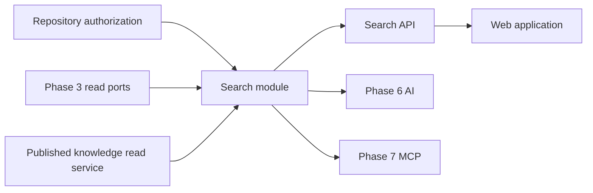
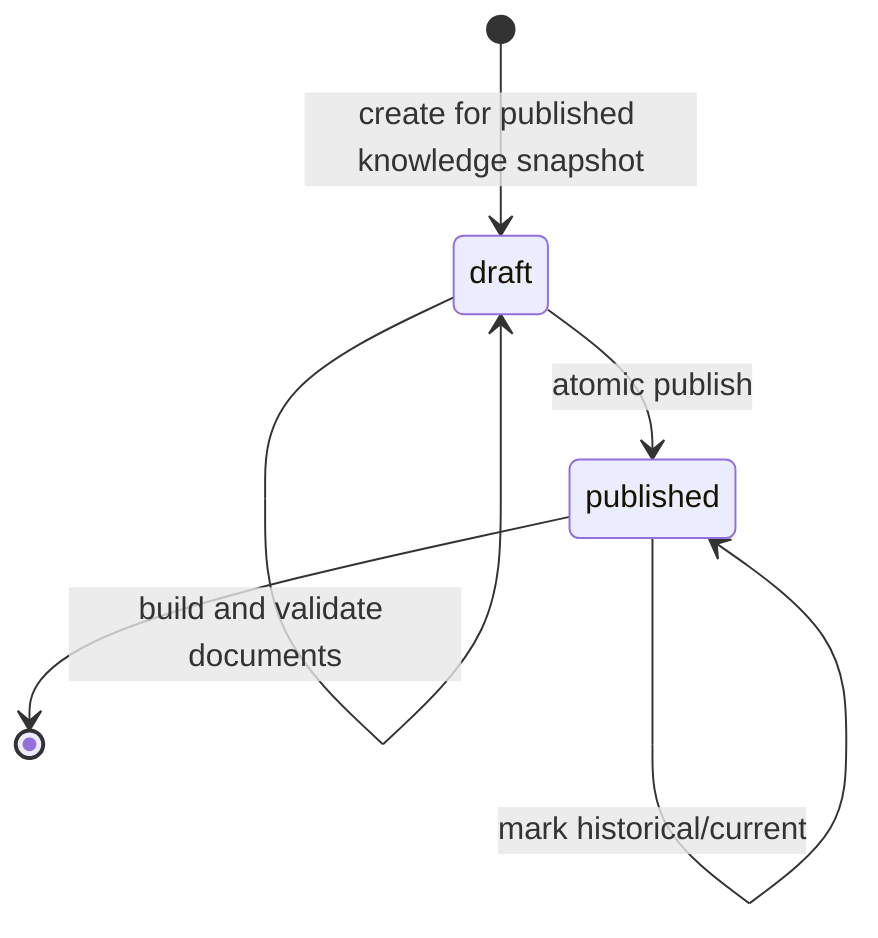
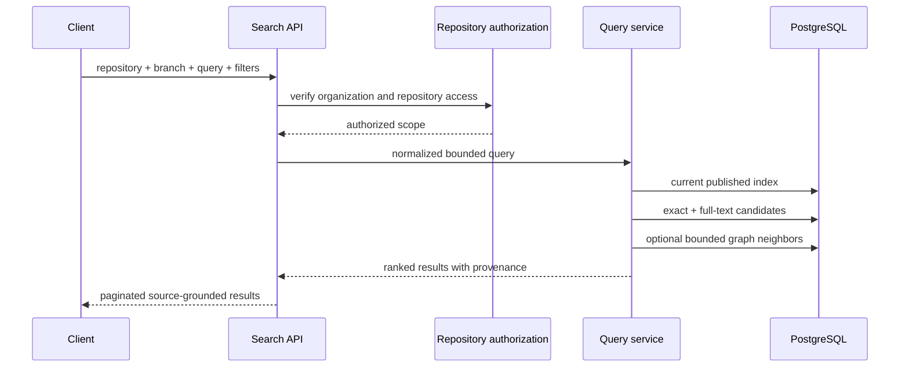

# Search Module

## Purpose

The Search module turns published Phase 3 and Phase 4 data into a small,
rankable retrieval projection. It answers where relevant code or knowledge is
located; it does not generate AI answers and it does not replace the indexing
or knowledge sources of truth.

Status: Phase 5 in progress. Architecture, persistence, projection building,
exact/lexical retrieval, bounded graph expansion, and explainable ranking are
implemented and exposed through a tenant-scoped API. The web search experience
is next.

## Responsibilities

The module owns:

- Versioned search projections and atomic publication
- Search-document construction from files, symbols, and knowledge nodes
- Exact identifier, path, and PostgreSQL full-text retrieval
- Bounded graph-aware result expansion
- Deterministic ranking, deduplication, filtering, and score explanations
- Tenant, repository, branch, and commit scope in every result
- A stable retrieval contract for the web application, AI, and MCP modules

The module does not own:

- Git access or source parsing
- Structural symbol/dependency truth
- Knowledge extraction or knowledge-graph truth
- Repository authorization policy definitions
- AI prompts, completions, or conversation state
- Embeddings until a measured retrieval need justifies them

## Dependency direction



Search may consume exported read services or ports. Indexing and Knowledge
must never import Search.

## Projection lifecycle



One search index targets exactly one successful index job and published
knowledge snapshot. Documents remain invisible until publication. A published
index is immutable, and only one index can be current for a branch.

If the branch advances while a projection is being built, the projection can
be published as historical but cannot replace the current branch index.

## Search document types

| Source type      | Authoritative record | Typical searchable content                          |
| ---------------- | -------------------- | --------------------------------------------------- |
| `file`           | Indexed file + hash  | Path, language, and bounded source/document text    |
| `symbol`         | Code symbol          | Name, qualified name, kind, signature, and docs     |
| `knowledge_node` | Knowledge node       | Name, summary, kind, and bounded derived properties |

Every document keeps foreign-key provenance to its source record. Business
rules and workflows are `knowledge_node` documents whose `kind` describes the
specific knowledge family.

## Initial query flow



The query service will use parameterized SQL and a fixed sort tiebreaker. It
will not accept raw `tsquery`, SQL fragments, or client-provided ranking
expressions.

## Planned module layout

```text
src/modules/search/
├── dto/                 # API validation (Milestone 5.7)
├── entities/            # search indexes and documents
├── enums/               # persisted search states and source kinds
├── projection/          # document builders (Milestone 5.3)
├── ranking/             # deterministic score fusion (Milestone 5.6)
├── repositories/        # persistence and read queries
├── services/            # build and query orchestration
├── search.controller.ts # Milestone 5.7
└── search.module.ts
```

Folders are added only with their owning milestone; empty placeholders are not
kept in source control.

## Milestones

| Milestone | Outcome                                            | Status   |
| --------: | -------------------------------------------------- | -------- |
|       5.1 | Architecture, boundaries, ranking and engine ADR   | Complete |
|       5.2 | Versioned search-index and document schema         | Complete |
|       5.3 | Projection builder and atomic publication          | Complete |
|       5.4 | Exact identifier, path, symbol, and lexical search | Complete |
|       5.5 | Bounded dependency and knowledge-graph expansion   | Complete |
|       5.6 | Ranking, deduplication, filters, and explanations  | Complete |
|       5.7 | Tenant-scoped search APIs                          | Complete |
|       5.8 | Web search experience                              | Next     |
|       5.9 | Quality, security, performance tests and docs      | Planned  |

## Implemented projection behavior

Milestone 5.3 builds one deterministic projection from a published knowledge
snapshot and its successful Phase 3 index job:

- Reads current file versions through the Phase 3 code-intelligence port
- Reads bounded immutable UTF-8 blobs through the hardened source-reader port
- Normalizes camelCase, PascalCase, snake_case, paths, and punctuation into
  lexical terms without executing source code
- Produces one file document, one document per symbol, and one document per
  knowledge node
- Extracts bounded scalar terms from knowledge properties
- Enforces per-document, total-byte, total-document, and batch limits
- Serializes builds per branch with a PostgreSQL advisory lock
- Clears retryable drafts, upserts deterministic batches, and publishes in one
  transaction
- Reuses an identical published projection by indexer version and configuration
  digest
- Publishes a historical projection without selecting it as current when its
  branch or knowledge snapshot has advanced

The service is exported for the retrieval/API orchestration added by later
milestones. Search projection building is not exposed as an HTTP endpoint yet.

## Implemented lexical query behavior

Milestone 5.4 searches only the current published index for an explicitly
scoped organization, repository, and branch.

Candidate signals are:

- Exact symbol identifier
- Exact document title
- Exact repository-relative path
- Identifier and title prefix
- Path containment
- Weighted PostgreSQL full-text match

Exact identifier, title, and path matches receive the strongest deterministic
weights. Full-text rank is then added, followed by stable source-type, title,
and document-ID tiebreakers. Responses include each match signal and immutable
file/hash/symbol/knowledge-node provenance.

Queries support optional source-type, language, and kind filters plus bounded
pagination. Query text is trimmed, length checked, and normalized with the same
technical-token rules used by projection building. SQL remains parameterized;
clients cannot provide raw `tsquery`, SQL, or ranking expressions.

The query service remains an exported internal boundary and is also consumed by
the permission-guarded HTTP endpoint added in Milestone 5.7.

## Implemented graph-expansion behavior

Milestone 5.5 expands the strongest lexical results through one immutable graph
hop:

- File and symbol seeds traverse incoming and outgoing Phase 3 code
  dependencies.
- Knowledge-node seeds traverse incoming and outgoing Phase 4 knowledge edges.
- Every neighbor must have a document in the same published search index.
- Code relationships are restricted to the same organization, repository, and
  branch; knowledge relationships are additionally restricted to the exact
  published knowledge snapshot.
- Source-type, language, and kind filters also apply to graph candidates.
- Seed count, neighbors per seed, and total candidates are independently
  bounded by validated environment configuration.
- Duplicate seed/neighbor pairs choose one deterministic relationship, and all
  rows use stable ordering.

Graph candidates are returned in a separate `graphExpansion` block with the
seed document ID, relationship source, kind, direction, depth, complete source
provenance, and truncation state. Lexical pagination remains unchanged.
Milestone 5.6 combines lexical and graph signals into one deduplicated,
explainable ranked result list.

## Implemented ranking behavior

Milestone 5.6 returns one deterministic result list from the bounded lexical
and graph candidate sets:

- Exact identifier, title, path, prefix, containment, and PostgreSQL full-text
  scores remain visible as individual explanation signals.
- Graph contributions inherit relevance from their lexical seed, distinguish
  structural dependencies from knowledge relationships, and are capped so
  graph connectivity cannot overwhelm direct query evidence.
- Results are deduplicated by immutable search-document ID across lexical
  matches and all graph paths.
- Stable ordering uses total score, lexical score, source type, title, and
  document ID.
- Every result reports lexical, graph, and total scores plus human-readable
  signal descriptions and graph seed IDs.
- Ranking metadata reports candidate, deduplicated, returned, and truncated
  counts.

Fusion is intentionally bounded to the requested lexical page and its graph
neighbors. Pagination totals continue to describe the lexical match universe;
the public API exposes this distinction explicitly rather than presenting
graph candidates as independently pageable matches.

## Implemented HTTP boundary

Milestone 5.7 exposes `GET /api/v1/repositories/:repositoryId/search`. The
controller requires `repository.read` plus `search.use`, derives organization
scope from the authenticated access token, and accepts validated branch,
query, filter, and pagination parameters. Unknown parameters are rejected.

Cross-organization repository identifiers return `404`, and branches without a
current published search index return `404`. The public response omits internal
organization scope while retaining repository, branch, commit, source-index,
knowledge-snapshot, ranking, and source-provenance information.
