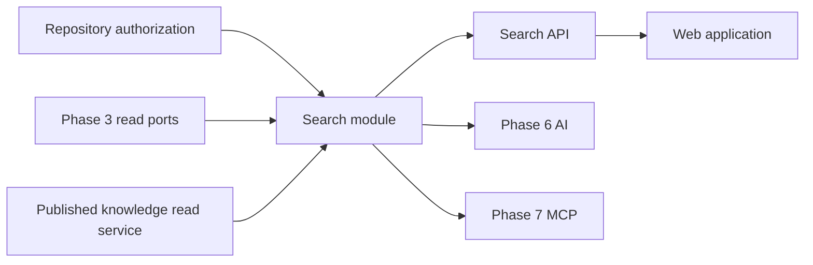
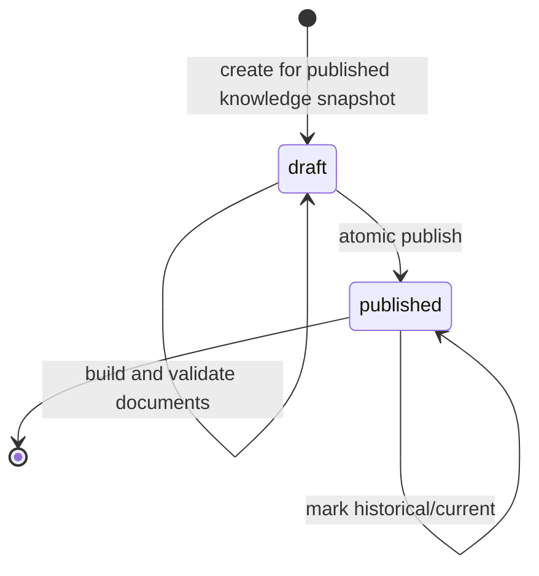
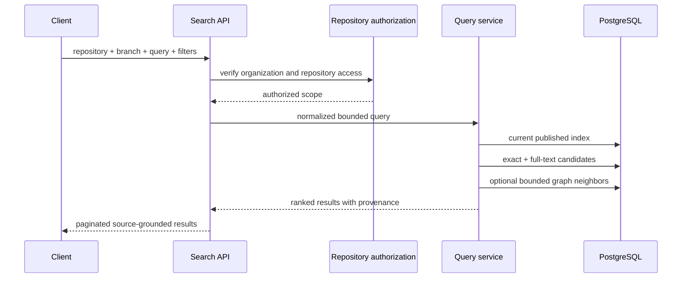

# Search Module

## Purpose

The Search module turns published Phase 3 and Phase 4 data into a small,
rankable retrieval projection. It answers where relevant code or knowledge is
located; it does not generate AI answers and it does not replace the indexing
or knowledge sources of truth.

Status: Phase 5 in progress. Architecture and persistence foundation are
implemented; projection building and query APIs are next.

## Responsibilities

The module owns:

- Versioned search projections and atomic publication
- Search-document construction from files, symbols, and knowledge nodes
- Exact identifier, path, and PostgreSQL full-text retrieval
- Bounded graph-aware result expansion
- Deterministic ranking, deduplication, filtering, and score explanations
- Tenant, repository, branch, and commit scope in every result
- A stable retrieval contract for the web application, AI, and MCP modules

The module does not own:

- Git access or source parsing
- Structural symbol/dependency truth
- Knowledge extraction or knowledge-graph truth
- Repository authorization policy definitions
- AI prompts, completions, or conversation state
- Embeddings until a measured retrieval need justifies them

## Dependency direction



Search may consume exported read services or ports. Indexing and Knowledge
must never import Search.

## Projection lifecycle



One search index targets exactly one successful index job and published
knowledge snapshot. Documents remain invisible until publication. A published
index is immutable, and only one index can be current for a branch.

If the branch advances while a projection is being built, the projection can
be published as historical but cannot replace the current branch index.

## Search document types

| Source type      | Authoritative record | Typical searchable content                          |
| ---------------- | -------------------- | --------------------------------------------------- |
| `file`           | Indexed file + hash  | Path, language, and bounded source/document text    |
| `symbol`         | Code symbol          | Name, qualified name, kind, signature, and docs     |
| `knowledge_node` | Knowledge node       | Name, summary, kind, and bounded derived properties |

Every document keeps foreign-key provenance to its source record. Business
rules and workflows are `knowledge_node` documents whose `kind` describes the
specific knowledge family.

## Initial query flow



The query service will use parameterized SQL and a fixed sort tiebreaker. It
will not accept raw `tsquery`, SQL fragments, or client-provided ranking
expressions.

## Planned module layout

```text
src/modules/search/
├── dto/                 # API validation (Milestone 5.7)
├── entities/            # search indexes and documents
├── enums/               # persisted search states and source kinds
├── projection/          # document builders (Milestone 5.3)
├── ranking/             # deterministic score fusion (Milestone 5.6)
├── repositories/        # persistence and read queries
├── services/            # build and query orchestration
├── search.controller.ts # Milestone 5.7
└── search.module.ts
```

Folders are added only with their owning milestone; empty placeholders are not
kept in source control.

## Milestones

| Milestone | Outcome                                            | Status   |
| --------: | -------------------------------------------------- | -------- |
|       5.1 | Architecture, boundaries, ranking and engine ADR   | Complete |
|       5.2 | Versioned search-index and document schema         | Complete |
|       5.3 | Projection builder and atomic publication          | Next     |
|       5.4 | Exact identifier, path, symbol, and lexical search | Planned  |
|       5.5 | Bounded dependency and knowledge-graph expansion   | Planned  |
|       5.6 | Ranking, deduplication, filters, and explanations  | Planned  |
|       5.7 | Tenant-scoped search APIs                          | Planned  |
|       5.8 | Web search experience                              | Planned  |
|       5.9 | Quality, security, performance tests and docs      | Planned  |
