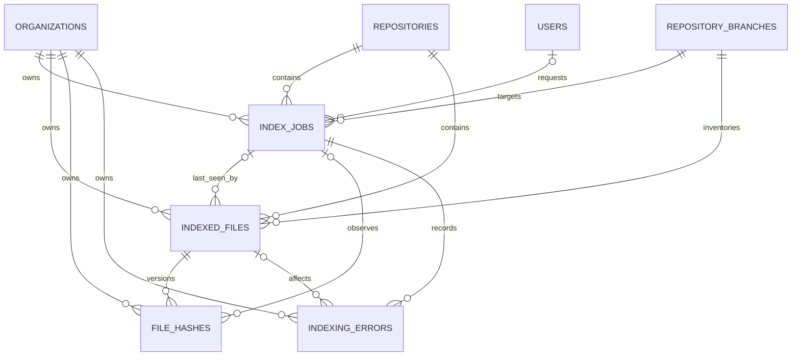

# Indexing Schema and Persistence Strategy

## Document information

Status: Phase 3.1 schema implemented
Version: 2.1
Owner: CodeMind Engineering
Architecture decision: [ADR-012](../06-adrs/012-indexing-engine.md)

## Goal

Indexing must survive process restarts and preserve the exact Git snapshot that
produced code metadata. PostgreSQL is the source of truth for jobs, file
inventory, content versions, progress, and sanitized failures. A future queue
may notify workers, but it is not the durable record of work.

The Phase 3.1 schema contains:

- `index_jobs` for durable orchestration
- `indexed_files` for stable branch/path inventory
- `file_hashes` for immutable content observations
- `indexing_errors` for operational failure records

All high-volume indexing records use auto-increment integer IDs. Organization
and user references retain UUIDs.

## Entity relationship diagram



Organization IDs are intentionally repeated on high-volume tables. They make
tenant-scoped queries and indexes explicit. Application services must derive
the value from authenticated/job context and keep it consistent with the
referenced repository, branch, job, and file.

## `index_jobs`

| Column | Type | Null | Purpose |
|---|---|:---:|---|
| `id` | serial integer | No | Internal job identity |
| `organization_id` | UUID | No | Tenant boundary |
| `repository_id` | integer | No | Parent repository |
| `branch_id` | integer | No | Target branch |
| `requested_by_user_id` | UUID | Yes | Requesting user; null after user deletion or for future system work |
| `trigger` | `index_job_trigger` | No | `manual` or future `repository_sync` |
| `mode` | `indexing_mode` | No | `incremental` or `full` |
| `status` | `index_job_status` | No | Durable lifecycle state |
| `target_commit_sha` | varchar(64) | No | Immutable Git commit selected at creation |
| `total_files` | integer | No | Planned files |
| `processed_files` | integer | No | Successful files |
| `skipped_files` | integer | No | Reused, ignored, or unsupported files |
| `failed_files` | integer | No | Files with processing failures |
| `attempt_count` | integer | No | Worker attempts |
| `failure_code` | varchar(100) | Yes | Stable terminal error code |
| `failure_message` | varchar(1000) | Yes | Sanitized terminal summary |
| `started_at` | timestamptz | Yes | Latest processing start |
| `completed_at` | timestamptz | Yes | Terminal completion time |
| `created_at` | timestamptz | No | Queue time |
| `updated_at` | timestamptz | No | Last lifecycle update |

### Job constraints

Only one active job is allowed for a repository branch:

```sql
CREATE UNIQUE INDEX uq_index_jobs_active_repository_branch
ON index_jobs (repository_id, branch_id)
WHERE status IN ('queued', 'running');
```

The application performs an early duplicate check for a useful `409`; the
partial unique index remains authoritative when requests race.

Counters must be non-negative and obey:

```text
processed_files + skipped_files + failed_files <= total_files
```

## `indexed_files`

`indexed_files` represents the stable path identity inside one repository
branch. Content changes create `file_hashes`; they do not replace the file ID.

| Column | Type | Null | Purpose |
|---|---|:---:|---|
| `id` | serial integer | No | File/path identity |
| `organization_id` | UUID | No | Tenant boundary |
| `repository_id` | integer | No | Parent repository |
| `branch_id` | integer | No | Parent branch |
| `last_seen_job_id` | integer | Yes | Most recent job that observed this path |
| `current_file_hash_id` | integer | Yes | Current immutable content version after hashing |
| `path` | varchar(1024) | No | Repository-relative normalized path |
| `extension` | varchar(32) | Yes | Lowercase extension without interpretation |
| `language` | varchar(64) | Yes | Detected language; null until detection |
| `size_bytes` | integer | No | Current observed content size |
| `status` | `indexed_file_status` | No | `active` or `deleted` |
| `last_seen_commit_sha` | varchar(64) | No | Commit that last observed the current path state |
| `created_at` | timestamptz | No | First observation |
| `updated_at` | timestamptz | No | Latest inventory change |

The unique key is:

```text
UNIQUE (branch_id, path)
```

Paths use `/` separators, have no leading slash, and cannot contain traversal
segments or NUL bytes. The future scanner owns those validation rules before
persistence. Missing paths are marked `deleted` instead of immediately
removed, allowing downstream symbol and relationship cleanup to be explicit.

## `file_hashes`

`file_hashes` stores immutable content observations. It separates stable path
identity from content version identity.

`indexed_files.current_file_hash_id` points to the content version currently
observed at that path. The explicit pointer is required when a path changes and
later returns to an older hash; creation order alone cannot identify current
content reliably.

| Column | Type | Null | Purpose |
|---|---|:---:|---|
| `id` | serial integer | No | Content-version identity |
| `organization_id` | UUID | No | Tenant boundary |
| `indexed_file_id` | integer | No | Stable file/path identity |
| `observed_by_job_id` | integer | Yes | First job that persisted the version |
| `algorithm` | `file_hash_algorithm` | No | Currently `sha256` |
| `value` | varchar(128) | No | Lowercase digest |
| `git_blob_oid` | varchar(64) | No | Git object ID used for cheap change detection |
| `size_bytes` | integer | No | Hashed content size |
| `created_at` | timestamptz | No | First observation time |

The uniqueness rule is:

```text
UNIQUE (indexed_file_id, algorithm, value)
```

If a file returns to content seen earlier, the existing content version can be
reused. The tenant/algorithm/value index supports future parser-artifact reuse
without removing tenant scope.

## `indexing_errors`

`indexing_errors` preserves bounded, sanitized failures for operations and
file-level diagnostics.

| Column | Type | Null | Purpose |
|---|---|:---:|---|
| `id` | serial integer | No | Error identity |
| `organization_id` | UUID | No | Tenant boundary |
| `index_job_id` | integer | No | Owning job |
| `indexed_file_id` | integer | Yes | Affected file, when applicable |
| `phase` | `indexing_error_phase` | No | Pipeline stage |
| `code` | varchar(100) | No | Stable machine-readable code |
| `message` | varchar(1000) | No | Sanitized explanation |
| `retryable` | boolean | No | Whether retry policy may retry |
| `attempt_number` | integer | No | Attempt that recorded the failure |
| `created_at` | timestamptz | No | Failure time |

The message must not contain source content, credentials, absolute workspace
paths, raw Git output, or stack traces. Those belong in access-controlled
application logs.

Supported error phases are `discovery`, `materialization`, `hashing`,
`parsing`, `persistence`, and `finalization`.

## Enum catalog

| Enum | Values |
|---|---|
| `index_job_status` | `queued`, `running`, `succeeded`, `failed`, `cancelled` |
| `index_job_trigger` | `manual`, `repository_sync` |
| `indexing_mode` | `incremental`, `full` |
| `indexed_file_status` | `active`, `deleted` |
| `file_hash_algorithm` | `sha256` |
| `indexing_error_phase` | `discovery`, `materialization`, `hashing`, `parsing`, `persistence`, `finalization` |

`succeeded` intentionally means that all required metadata for the target
commit was committed. It is more precise than a generic `completed` state.

## Index catalog

| Table/index fields | Purpose |
|---|---|
| Jobs: organization, repository, created | Repository job history |
| Jobs: organization, status, created | Tenant operations queries |
| Jobs: branch | Branch history |
| Jobs: requester | Audit lookup |
| Files: organization, repository, status | Tenant repository inventory |
| Files: branch, status | Active/deleted branch inventory |
| Files: last-seen job | Job reconciliation |
| Hashes: organization, algorithm, value | Tenant-scoped content reuse |
| Hashes: Git blob ID | Incremental candidate lookup |
| Errors: organization, job, created | Ordered job diagnostics |
| Errors: file | File diagnostics |

## Foreign-key deletion rules

| Parent | Child | Behavior |
|---|---|---|
| Organization | All indexing tables | `RESTRICT` |
| Repository | Jobs and files | `CASCADE` |
| Branch | Jobs and files | `CASCADE` |
| User | Requested job | `SET NULL` |
| Job | Last-seen file / observed hash | `SET NULL` |
| Job | Indexing error | `CASCADE` |
| Indexed file | Hash versions | `CASCADE` |
| File hash | Indexed-file current pointer | `SET NULL` |
| Indexed file | Error reference | `SET NULL` |

Branch synchronization marks missing remote branches as `deleted`; it does
not normally delete branch rows. Repository deletion removes its operational
indexing data as one aggregate.

## Incremental decision model

ADR-012 defines a hybrid strategy:

```text
same target commit + incremental mode -> no-op success
same path + same Git blob ID          -> reuse content version
new blob + known SHA-256              -> reuse parser artifact when valid
new SHA-256                            -> parse new content version
missing previous path                  -> mark indexed file deleted
```

Git object IDs avoid reading most unchanged blobs. SHA-256 remains the durable
cross-Git-format content identity and is computed while bounded content is
read.

## Transaction boundaries

The API creates a queued job with one short database write after tenant and
branch validation. No clone, fetch, filesystem, parser, or AI work occurs in
that request transaction.

Future workers will:

1. Claim a job in a short atomic transaction.
2. Scan/hash/parse outside a transaction.
3. Commit inventory and content versions in bounded idempotent batches.
4. Mark deleted paths only after the scan result is durable.
5. Set `succeeded` only after every required batch commits.

Long-running processing must never hold a database connection or row lock.

## Migrations

The foundation is introduced in two additive migrations:

```text
1785610000000-AddIndexJobs.ts
1785620000000-CompleteIndexingFoundation.ts
1785630000000-AddCurrentFileHash.ts
```

The split is intentional: the durable job/API slice landed first, the ADR
expanded Phase 3.1 to the complete inventory, hash, error, and mode model, and
incremental processing added the explicit current-content pointer.

Commands:

```bash
yarn migration:show
yarn migration:run
yarn migration:revert
yarn typeorm schema:log -d src/database/data-source.ts
```

After all migrations are applied, `schema:log` must generate no SQL.
