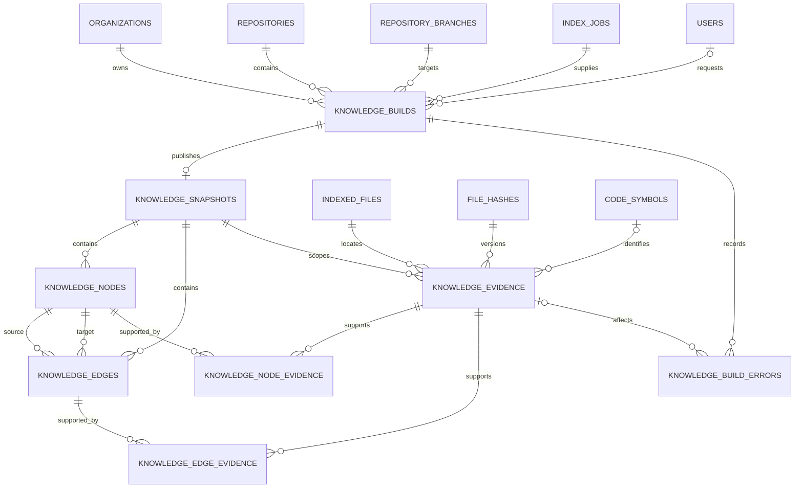

# Knowledge Graph Schema

## Document information

Status: Implemented in Milestone 4.3
Version: 1.1
Owner: CodeMind Engineering
Architecture decision:
[ADR-014](../06-adrs/014-knowledge-analysis-architecture.md)

## Purpose

The Phase 4 schema stores commit-scoped architectural and business knowledge
derived from Phase 3 files, hashes, symbols, and dependencies. It does not copy
or replace those structural records.

This document defines the schema implemented by the Milestone 4.3 TypeORM
entities and `1785680000000-AddKnowledgeGraphFoundation` migration.

## Storage principles

- PostgreSQL remains the system of record.
- Every build targets one successful index job and immutable commit.
- Published snapshots are immutable.
- Only complete snapshots are visible to readers.
- Every node and edge has source evidence.
- Organization and repository scope is explicit on high-volume tables.
- Auto-increment integers are used for internal Phase 4 IDs.
- Raw source, credentials, stack traces, and unbounded generated text are not
  stored in graph records.

## Entity relationship diagram



## `knowledge_builds`

Tracks durable Phase 4 background processing. The final migration should reuse
the claim/lease invariants proven by `index_jobs` without sharing its rows.

Planned columns:

| Column                    | Type           | Null | Purpose                                     |
| ------------------------- | -------------- | :--: | ------------------------------------------- |
| `id`                      | serial integer |  No  | Internal build identity                     |
| `organization_id`         | UUID           |  No  | Tenant boundary                             |
| `repository_id`           | integer        |  No  | Parent repository                           |
| `branch_id`               | integer        |  No  | Target branch                               |
| `source_index_job_id`     | integer        |  No  | Successful Phase 3 snapshot source          |
| `requested_by_user_id`    | UUID           | Yes  | Manual requester or null for system work    |
| `trigger`                 | enum           |  No  | `manual` or `indexing_completed`            |
| `status`                  | enum           |  No  | Durable build status                        |
| `phase`                   | enum           |  No  | Detailed processing phase                   |
| `target_commit_sha`       | varchar(64)    |  No  | Immutable source commit                     |
| `analyzer_bundle_version` | varchar(100)   |  No  | Reproducible analyzer release               |
| `configuration_digest`    | varchar(64)    |  No  | SHA-256 of semantic analyzer settings       |
| Progress counters         | integer        |  No  | Files, facts, nodes, edges, and failures    |
| Attempt/lease columns     | mixed          | Yes  | Claim, heartbeat, retry, and recovery state |
| Failure columns           | varchar        | Yes  | Stable code and bounded sanitized message   |
| Lifecycle timestamps      | timestamptz    | Yes  | Queue, start, heartbeat, retry, finish      |

Required constraints:

- Only one queued/running build per branch.
- The source index job belongs to the same tenant, repository, branch, and
  target commit and has status `succeeded`.
- Counters are non-negative and monotonic during an attempt.
- Running rows have a worker identity, unique lease token, heartbeat, and lease
  expiry; non-running rows do not.
- Attempt count cannot exceed the configured maximum.

## `knowledge_snapshots`

Represents an immutable, successfully published graph.

| Column                    | Type           | Null | Purpose                               |
| ------------------------- | -------------- | :--: | ------------------------------------- |
| `id`                      | serial integer |  No  | Snapshot identity                     |
| `organization_id`         | UUID           |  No  | Tenant boundary                       |
| `repository_id`           | integer        |  No  | Parent repository                     |
| `branch_id`               | integer        |  No  | Source branch                         |
| `knowledge_build_id`      | integer        |  No  | Publishing build; unique              |
| `source_index_job_id`     | integer        |  No  | Phase 3 source snapshot               |
| `target_commit_sha`       | varchar(64)    |  No  | Immutable source commit               |
| `analyzer_bundle_version` | varchar(100)   |  No  | Analyzer release                      |
| `configuration_digest`    | varchar(64)    |  No  | Semantic configuration identity       |
| `status`                  | enum           |  No  | `draft` until atomically `published`  |
| `is_current`              | boolean        |  No  | Current published snapshot for branch |
| `published_at`            | timestamptz    | Yes  | Atomic publication time               |
| `superseded_at`           | timestamptz    | Yes  | Time replaced as current              |
| `created_at`              | timestamptz    |  No  | Row creation time                     |

Planned uniqueness:

```text
UNIQUE (knowledge_build_id)
UNIQUE (branch_id) WHERE is_current = true
UNIQUE (
  branch_id,
  target_commit_sha,
  analyzer_bundle_version,
  configuration_digest
)
```

A draft has null `published_at` and cannot be current. A completed snapshot
becomes current only if the branch still references its target commit.
Historical published snapshots remain queryable by explicit snapshot ID.

## `knowledge_nodes`

Stores typed knowledge facts inside one snapshot.

| Column                    | Type           | Null | Purpose                                             |
| ------------------------- | -------------- | :--: | --------------------------------------------------- |
| `id`                      | serial integer |  No  | Snapshot-local node identity                        |
| `organization_id`         | UUID           |  No  | Tenant boundary                                     |
| `repository_id`           | integer        |  No  | Repository query scope                              |
| `branch_id`               | integer        |  No  | Branch query scope                                  |
| `snapshot_id`             | integer        |  No  | Immutable graph owner                               |
| `identity_key`            | varchar(512)   |  No  | Deterministic identity within kind                  |
| `kind`                    | enum           |  No  | Architecture/domain/rule/workflow/state/event kind  |
| `name`                    | varchar(512)   |  No  | Human-readable fact name                            |
| `summary`                 | varchar(4000)  | Yes  | Bounded explanation, not raw source                 |
| `derivation_type`         | enum           |  No  | Deterministic, heuristic, AI-assisted, or confirmed |
| `confidence`              | numeric(5,4)   |  No  | Value from zero through one                         |
| `analyzer_name`           | varchar(100)   |  No  | Producing analyzer                                  |
| `analyzer_version`        | varchar(100)   |  No  | Producing analyzer version                          |
| `content_fingerprint`     | varchar(64)    |  No  | Stable normalized content digest                    |
| `property_schema_version` | integer        |  No  | Validator version for `properties`                  |
| `properties`              | JSONB          |  No  | Bounded kind-specific attributes                    |
| `created_at`              | timestamptz    |  No  | Persistence time                                    |

Planned identity:

```text
UNIQUE (snapshot_id, kind, identity_key)
```

Initial kinds include architectural component, domain concept, business rule,
workflow, workflow step, state, state transition, domain event, and event
handler. The migration should use a stable enum or constrained catalog after
the Milestone 4.2 analyzer contract fixes the exact values.

## `knowledge_edges`

Stores typed directed relationships between nodes in the same snapshot.

| Column                    | Type           | Null | Purpose                             |
| ------------------------- | -------------- | :--: | ----------------------------------- |
| `id`                      | serial integer |  No  | Edge identity                       |
| Tenant/snapshot columns   | mixed          |  No  | Same explicit scope as nodes        |
| `source_node_id`          | integer        |  No  | Source node                         |
| `target_node_id`          | integer        |  No  | Target node                         |
| `identity_key`            | varchar(512)   |  No  | Deterministic edge identity         |
| `kind`                    | enum           |  No  | Typed relationship                  |
| Derivation columns        | mixed          |  No  | Type, confidence, analyzer, version |
| `content_fingerprint`     | varchar(64)    |  No  | Normalized edge digest              |
| `property_schema_version` | integer        |  No  | Properties validator version        |
| `properties`              | JSONB          |  No  | Bounded kind-specific attributes    |
| `created_at`              | timestamptz    |  No  | Persistence time                    |

Required constraints:

- Source and target nodes belong to the edge snapshot and tenant.
- Self-edges are allowed only for explicitly approved kinds.
- Confidence is between zero and one.
- `UNIQUE (snapshot_id, kind, identity_key)`.

Initial kinds include `contains`, `depends_on`, `calls`, `handles`, `represents`,
`enforces`, `triggers`, `precedes`, and `transitions_to`.

## `knowledge_evidence`

Stores immutable provenance without copying source text.

| Column                  | Type           | Null | Purpose                                                       |
| ----------------------- | -------------- | :--: | ------------------------------------------------------------- |
| `id`                    | serial integer |  No  | Evidence identity                                             |
| Tenant/snapshot columns | mixed          |  No  | Explicit graph scope                                          |
| `indexed_file_id`       | integer        |  No  | Stable branch/path identity                                   |
| `file_hash_id`          | integer        |  No  | Immutable content version                                     |
| `code_symbol_id`        | integer        | Yes  | Supporting declaration                                        |
| `role`                  | enum           |  No  | Declaration, call, condition, assignment, configuration, etc. |
| Source range columns    | integer        | Yes  | Line, column, and offset range                                |
| `created_at`            | timestamptz    |  No  | Persistence time                                              |

An evidence row must reference the same organization, repository, branch, and
commit represented by its snapshot. When a symbol is present, it must belong to
the referenced file and hash. Range coordinates are either all absent or form a
valid ordered range inside the persisted file size.

Evidence uniqueness should be based on snapshot, file hash, optional symbol,
role, and source offsets.

## Evidence link tables

`knowledge_node_evidence` and `knowledge_edge_evidence` contain composite
primary keys and cascading foreign keys:

```text
PRIMARY KEY (knowledge_node_id, knowledge_evidence_id)
PRIMARY KEY (knowledge_edge_id, knowledge_evidence_id)
```

Publication validation requires at least one evidence link for every node and
edge. Separate link tables retain real foreign keys and avoid unsafe
polymorphic `subject_type`/`subject_id` columns.

## `knowledge_build_errors`

Stores bounded operational diagnostics linked to a build and optionally an
evidence location.

It records phase, analyzer, stable error code, sanitized message, retryability,
attempt number, and timestamp. Source content, absolute paths, credentials, raw
Git output, and stack traces remain in access-controlled application logs.

## Transaction and publication model

Analyzers emit bounded fact batches outside long database transactions. The
knowledge persistence layer writes unpublished snapshot data idempotently.

Publication performs one short transaction that:

1. Verifies the worker lease and build target.
2. Validates node/edge identity and evidence completeness.
3. Marks the snapshot published.
4. Clears the previous current snapshot when appropriate.
5. Marks the new snapshot current only when the branch commit still matches.
6. Moves the build to `succeeded`.

Readers filter to published snapshots and never observe partial graphs.

## Index strategy

The initial migration should provide indexes for:

- Claimable and expired knowledge builds
- Organization/repository/build history
- Current snapshot by branch
- Snapshot node kind and name
- Snapshot node identity key
- Outgoing and incoming edge traversal
- Snapshot edge kind
- Evidence by file hash and symbol
- Node/edge evidence joins
- Analyzer version and content fingerprint comparison

Recursive graph queries must enforce maximum depth, node count, edge count, and
statement timeout at the service boundary.

## Deletion and retention

- Organization deletion remains restricted by the platform policy.
- Repository deletion cascades through builds and snapshots.
- Branch deletion cascades only if the branch row itself is deleted; normal Git
  synchronization marks it deleted instead.
- Deleting a snapshot cascades through its nodes, edges, evidence, and links.
- Phase 3 source rows referenced by a published snapshot should use `RESTRICT`
  until a retention policy removes the snapshot.
- Snapshot retention and analyzer-version pruning are Phase 4 operational
  policies and must never silently remove the current snapshot.

## Deferred storage decisions

The following are explicitly outside the first migration:

- Neo4j or another graph database
- Embeddings and vector indexes
- Separate `business_*` tables that duplicate graph facts
- Raw source excerpts
- Unbounded analyzer payloads
- AI conversation memory

Those decisions require measured queries or belong to later phases.

## Implementation sequence

1. Milestone 4.2 fixed analyzer fact kinds and read ports.
2. Milestone 4.3 converted this design into entities and a TypeORM migration.
3. PostgreSQL integration coverage verifies snapshot publication, evidence
   completeness and source-version integrity, immutability, and branch-move
   behavior.
4. Lifecycle retry and current-snapshot concurrency coverage expands with the
   Milestone 4.8 worker implementation.
