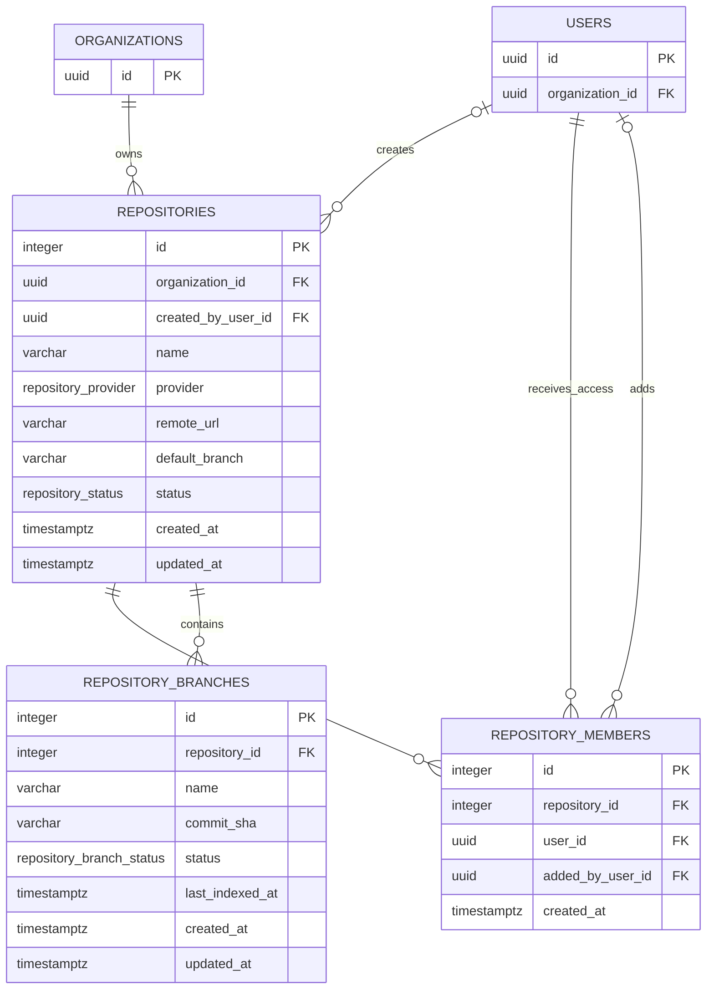

# Repository Data Model

## Document information

Status: Foundation, membership, and branch synchronization implemented
Version: 1.2
Owner: CodeMind Engineering

## Scope

The repository data model provides the persistent identity and relationships
required for repository registration, repository-specific access, and Git
branch tracking.

This model supports repository registration, membership, and synchronized
Git branch APIs. Repository source indexing remains a later milestone.

## Entity relationship diagram



## Identifier policy

Repository-domain records use PostgreSQL auto-increment integers:

- `repositories.id`
- `repository_members.id`
- `repository_branches.id`

Identity-domain records retain UUIDs:

- `organizations.id`
- `users.id`
- `roles.id`
- `auth_sessions.id`

Therefore, repository ownership and membership user references remain UUID
foreign keys even though the repository-domain primary keys are integers.

## Repositories

The `repositories` table stores tenant-owned repository metadata.

| Column | Type | Null | Purpose |
|---|---|---:|---|
| `id` | serial | No | Repository identity |
| `organization_id` | uuid | No | Owning tenant |
| `created_by_user_id` | uuid | Yes | User that registered the repository |
| `name` | varchar(160) | No | Display name |
| `provider` | `repository_provider` | No | Remote provider |
| `remote_url` | varchar(2048) | No | Normalized clone URL |
| `default_branch` | varchar(255) | Yes | Configured default branch |
| `status` | `repository_status` | No | Active/disabled lifecycle |
| `created_at` | timestamptz | No | Creation time |
| `updated_at` | timestamptz | No | Last metadata update |

Constraints:

- Unique `(organization_id, remote_url)`
- Organization deletion is restricted while repositories exist
- Deleting the creating user sets `created_by_user_id` to null

## Repository members

The `repository_members` table grants a user access to a specific repository.
It does not replace organization roles and permissions. Membership management
requires platform authorization, and the target user must belong to the
repository's organization.

| Column | Type | Null | Purpose |
|---|---|---:|---|
| `id` | serial | No | Membership identity |
| `repository_id` | integer | No | Repository receiving the grant |
| `user_id` | uuid | No | User receiving access |
| `added_by_user_id` | uuid | Yes | User that created the grant |
| `created_at` | timestamptz | No | Grant creation time |

Constraints:

- Unique `(repository_id, user_id)`
- Repository deletion cascades to its memberships
- User deletion cascades to memberships received by that user
- Deleting the granting user sets `added_by_user_id` to null

The Milestone 2.3 service verifies the repository and target user using the
authenticated organization. Organization IDs always come from the
authenticated identity rather than request payloads.

## Repository branches

The `repository_branches` table stores the last known state of branches
reported by the Git adapter.

| Column | Type | Null | Purpose |
|---|---|---:|---|
| `id` | serial | No | Branch identity |
| `repository_id` | integer | No | Parent repository |
| `name` | varchar(255) | No | Full branch name |
| `commit_sha` | varchar(64) | Yes | Last observed Git object ID |
| `status` | `repository_branch_status` | No | `active` or `deleted` |
| `last_indexed_at` | timestamptz | Yes | Last successful indexing time |
| `created_at` | timestamptz | No | First observation time |
| `updated_at` | timestamptz | No | Last metadata update |

Constraints:

- Unique `(repository_id, name)`
- Repository deletion cascades to its branches
- Commit SHA supports SHA-1 and SHA-256 Git object formats

A deleted remote branch is retained with `status = deleted` so indexing
history can be reconciled safely. A later retention policy may remove old
deleted branches. If the same branch reappears, synchronization restores it to
`active`, updates its commit SHA, and preserves `last_indexed_at` for later
incremental-index decisions.

## Enums

### `repository_provider`

- `github`
- `gitlab`
- `bitbucket`
- `generic`

### `repository_status`

- `active`
- `disabled`

### `repository_branch_status`

- `active`
- `deleted`

## Ownership and deletion rules

```text
Organization
    └── Repository
          ├── RepositoryMember
          └── RepositoryBranch
```

- An organization cannot be deleted while it owns repositories.
- Deleting a repository removes its branch and membership records.
- Deleting a user removes access granted to that user.
- Historical creator/grantor references become null when those users are
  deleted.

These rules prevent orphan repository data while retaining useful audit
context where possible.
