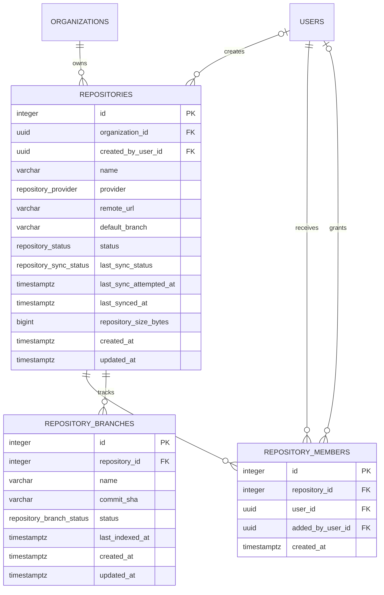

# Repository Database Schema

## Document information

Status: Phase 2 repository schema complete
Version: 3.0
Owner: CodeMind Engineering

## Purpose

This document records the PostgreSQL schema implemented for repository
registration, repository memberships, and Git branches.

The complete relationship diagram, field definitions, and lifecycle rules are
in [Repository Data Model](repository-model.md).

## Entity relationship diagram



Repository-domain primary keys are auto-increment integers. Identity-domain
foreign keys remain UUIDs.

## Tables

### `repositories`

Stores organization-owned repository metadata.

| Column | PostgreSQL type | Null | Default | Purpose |
|---|---|:---:|---|---|
| `id` | `serial` | No | sequence | Primary key |
| `organization_id` | `uuid` | No | — | Owning organization and tenant scope |
| `created_by_user_id` | `uuid` | Yes | `NULL` | User that registered the repository |
| `name` | `varchar(160)` | No | — | Display name |
| `provider` | `repository_provider` | No | — | Provider detected from URL |
| `remote_url` | `varchar(2048)` | No | — | Normalized credential-free URL |
| `default_branch` | `varchar(255)` | Yes | `NULL` | Configured or detected default branch |
| `status` | `repository_status` | No | `active` | Repository lifecycle |
| `last_sync_status` | `repository_sync_status` | No | `never` | Latest synchronization outcome |
| `last_sync_attempted_at` | `timestamptz` | Yes | `NULL` | Start time of latest recorded attempt |
| `last_synced_at` | `timestamptz` | Yes | `NULL` | Completion time of latest success |
| `repository_size_bytes` | `bigint` | Yes | `NULL` | Git object size from latest success |
| `created_at` | `timestamptz` | No | `now()` | Creation time |
| `updated_at` | `timestamptz` | No | `now()` | Latest persisted update |

Primary key:

- `id` — auto-increment integer

Foreign keys:

- `organization_id -> organizations.id` with `ON DELETE RESTRICT`
- `created_by_user_id -> users.id` with `ON DELETE SET NULL`

Indexes:

| Name | Columns | Purpose |
|---|---|---|
| `uq_repositories_organization_remote_url` | `organization_id`, `remote_url` | Prevent duplicate source metadata inside one tenant |
| `idx_repositories_organization_status_created` | `organization_id`, `status`, `created_at` | Tenant listing and status filtering |
| `idx_repositories_created_by_user_id` | `created_by_user_id` | Creator relationship operations |
| `idx_repositories_organization_sync_status` | `organization_id`, `last_sync_status` | Tenant health filtering |

Health columns:

- `last_sync_status` — durable `never`, `succeeded`, or `failed` state
- `last_sync_attempted_at` — latest completed attempt start
- `last_synced_at` — latest successful completion
- `repository_size_bytes` — last successful Git object-storage measurement

`CHK_repositories_repository_size_bytes` limits size to `NULL` or a value from
zero through `9007199254740991`, JavaScript's maximum safe integer.

### `repository_members`

Stores user access grants for individual repositories.

| Column | PostgreSQL type | Null | Default | Purpose |
|---|---|:---:|---|---|
| `id` | `serial` | No | sequence | Membership primary key |
| `repository_id` | `integer` | No | — | Parent repository |
| `user_id` | `uuid` | No | — | User receiving membership |
| `added_by_user_id` | `uuid` | Yes | `NULL` | User that granted membership |
| `created_at` | `timestamptz` | No | `now()` | Grant creation time |

Primary key:

- `id` — auto-increment integer

Foreign keys:

- `repository_id -> repositories.id` with `ON DELETE CASCADE`
- `user_id -> users.id` with `ON DELETE CASCADE`
- `added_by_user_id -> users.id` with `ON DELETE SET NULL`

Indexes:

| Name | Columns | Purpose |
|---|---|---|
| `uq_repository_members_repository_user` | `repository_id`, `user_id` | One membership per repository/user pair |
| `idx_repository_members_user_id` | `user_id` | User membership lookup |
| `idx_repository_members_added_by_user_id` | `added_by_user_id` | Grantor relationship operations |

### `repository_branches`

Stores the last known branch state from the Git provider.

| Column | PostgreSQL type | Null | Default | Purpose |
|---|---|:---:|---|---|
| `id` | `serial` | No | sequence | Branch primary key |
| `repository_id` | `integer` | No | — | Parent repository |
| `name` | `varchar(255)` | No | — | Full branch name |
| `commit_sha` | `varchar(64)` | Yes | `NULL` | Last observed SHA-1 or SHA-256 object ID |
| `status` | `repository_branch_status` | No | `active` | Remote branch lifecycle |
| `last_indexed_at` | `timestamptz` | Yes | `NULL` | Latest successful index time |
| `created_at` | `timestamptz` | No | `now()` | First observation time |
| `updated_at` | `timestamptz` | No | `now()` | Latest branch-state update |

Primary key:

- `id` — auto-increment integer

Foreign keys:

- `repository_id -> repositories.id` with `ON DELETE CASCADE`

Indexes:

| Name | Columns | Purpose |
|---|---|---|
| `uq_repository_branches_repository_name` | `repository_id`, `name` | Stable identity per repository/branch name |
| `idx_repository_branches_repository_status` | `repository_id`, `status` | Branch listing and health counts |
| `idx_repository_branches_last_indexed_at` | `last_indexed_at` | Index recency operations |

Synchronization upserts observed branches as `active`, updates changed commit
SHAs, and marks missing remote branches as `deleted`. It never hard-deletes a
branch during synchronization and does not change `last_indexed_at`.

## Lifecycle persistence

| Event | `last_sync_status` | `last_sync_attempted_at` | `last_synced_at` and size |
|---|---|---|---|
| Repository registered | `never` | `NULL` | `NULL` |
| Synchronization succeeds | `succeeded` | Replaced | Replaced with current success |
| Synchronization fails | `failed` | Replaced | Previous success retained |

Successful branch reconciliation and repository health updates occur in one
transaction while holding a write lock on the tenant-scoped repository row.
Failed Git attempts use a short transaction to record failure without erasing
the last known successful state.

## PostgreSQL enums

```text
repository_provider:
  github | gitlab | bitbucket | generic

repository_status:
  active | disabled

repository_branch_status:
  active | deleted

repository_sync_status:
  never | succeeded | failed
```

## Integrity boundary

PostgreSQL guarantees primary keys, unique pairs, value constraints, and
foreign-key deletion behavior. Tenant equivalence across related identity rows
is enforced by application services:

- `repository_members.user_id` must reference a user in the repository's
  organization
- `repository_members.added_by_user_id` comes from the authenticated user in
  the same organization
- `repositories.created_by_user_id` comes from the authenticated organization

Those rules cannot be represented by the current single-column foreign keys,
so direct SQL writers must not bypass the repository and user services.

Repository deletion cascades to branches and memberships. Organization
deletion is restricted while repositories exist. Deleting creator or grantor
users sets historical actor references to null; deleting a membership recipient
cascades that user's membership rows.

## Migration

The schema is managed by:

```text
src/database/migrations/1785510000000-AddRepositories.ts
src/database/migrations/1785600000000-AddRepositoryHealth.ts
```

TypeORM schema synchronization remains disabled. Apply reviewed changes only
through the migration workflow.

The application TypeORM connection includes migration metadata but keeps
`migrationsRun: false`; production startup does not mutate schemas. The E2E
harness explicitly runs pending migrations against a database whose actual
name ends with `_test`.

Verification commands:

```bash
yarn migration:show
yarn typeorm schema:log -d src/database/data-source.ts
yarn test:e2e
```

At Phase 2 completion, all six project migrations are applied, entity metadata
has no schema drift, and repository workflows pass against PostgreSQL.
