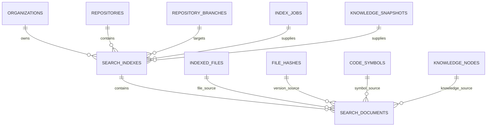
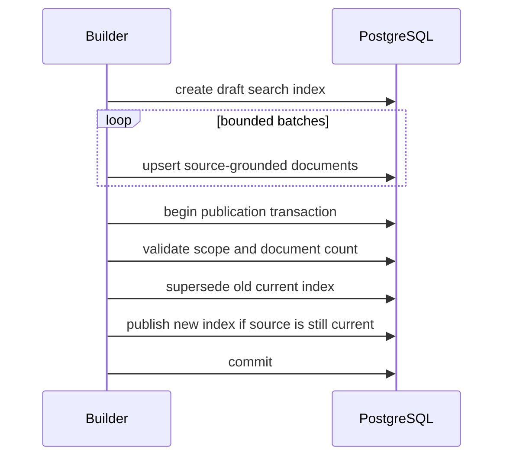
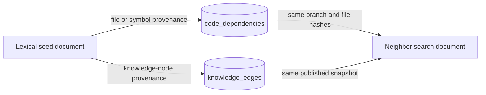

# Search Database Schema

## Scope

The Phase 5 foundation stores immutable, commit-scoped search projections in
PostgreSQL. It does not add vectors or another database.

## Entity relationship model

## `search_indexes`

A row identifies one complete search projection version.

| Column                  | Type         | Purpose                                   |
| ----------------------- | ------------ | ----------------------------------------- |
| `id`                    | integer      | Auto-increment internal identifier        |
| `organization_id`       | uuid         | Tenant scope                              |
| `repository_id`         | integer      | Repository scope                          |
| `branch_id`             | integer      | Branch scope                              |
| `source_index_job_id`   | integer      | Successful Phase 3 snapshot               |
| `knowledge_snapshot_id` | integer      | Published Phase 4 snapshot                |
| `target_commit_sha`     | varchar(64)  | Exact 40- or 64-character Git object ID   |
| `indexer_version`       | varchar(100) | Projection algorithm version              |
| `configuration_digest`  | varchar(64)  | SHA-256 digest of effective build policy  |
| `status`                | enum         | `draft` or `published`                    |
| `is_current`            | boolean      | Current searchable version for the branch |
| `document_count`        | integer      | Validated number of projection documents  |
| `published_at`          | timestamptz  | Publication time                          |
| `superseded_at`         | timestamptz  | Time replaced as current                  |
| `created_at`            | timestamptz  | Creation time                             |

Important constraints:

- The source index job must be successful.
- The knowledge snapshot must be published and match the same organization,
  repository, branch, source job, and commit.
- `(knowledge_snapshot_id, indexer_version, configuration_digest)` is unique.
- At most one search index is current per branch.
- Publication requires at least one document and an exact document count.
- A stale branch/knowledge snapshot cannot be selected as current.
- Identity and published content are immutable.

## `search_documents`

Each row is a bounded retrieval projection with direct source provenance.

| Column                | Type          | Purpose                                    |
| --------------------- | ------------- | ------------------------------------------ |
| `id`                  | integer       | Auto-increment internal identifier         |
| tenant/scope columns  | uuid/integer  | Organization, repository, branch, index    |
| `source_type`         | enum          | `file`, `symbol`, or `knowledge_node`      |
| `source_identity_key` | varchar(512)  | Stable identity within one search index    |
| source foreign keys   | integer/null  | File/hash/symbol/knowledge provenance      |
| `title`               | varchar(512)  | Primary exact-match and display value      |
| `content`             | text          | Bounded searchable projection text         |
| `path`                | varchar(1024) | Optional repository-relative source path   |
| `language`            | varchar(64)   | Optional language filter                   |
| `kind`                | varchar(100)  | Symbol or knowledge kind filter            |
| `metadata`            | jsonb         | Bounded display/ranking metadata           |
| `search_vector`       | tsvector      | Database-maintained weighted lexical terms |
| `created_at`          | timestamptz   | Creation time                              |

Source-reference rules:

- A file document references one indexed file and its exact current hash.
- A symbol document references one symbol, its indexed file, and file hash.
- A knowledge document references one node from the target knowledge snapshot.
- All source records must match the document's tenant, repository, branch, and
  search-index version.
- A source identity occurs once per source type and search index.

`content` is capped at 128 KiB and serialized `metadata` at 64 KiB. Projection
builders must apply smaller application-level limits where possible.

## Full-text index

A trigger constructs the vector with PostgreSQL's `simple` configuration:

| Weight | Fields             |
| ------ | ------------------ |
| A      | `title`, `path`    |
| B      | `kind`, `language` |
| C      | `content`          |

The `simple` configuration preserves technical tokens without English
stemming. A GIN index supports full-text lookup. A separate lower-case title
index supports exact/prefix identifier lookup.

Additional partial/expression indexes support exact and prefix lookup for
lower-cased repository paths and symbol names stored in document metadata.
These indexes are migration-managed and marked as manual in TypeORM metadata so
schema synchronization does not attempt to remove them.

Camel-case, snake-case, and qualified-name aliases are normalized by the
projection builder and included in bounded document content.

## Publication transaction

Readers filter to `status = 'published' AND is_current = true`, so incomplete
drafts are never visible.

## Graph expansion read path

Graph expansion does not add another graph table. It reads authoritative
relationships and resolves their endpoints back to documents in the selected
immutable search index:

Only one-hop incoming and outgoing relationships are read. The application
caps lexical seeds, neighbors per seed, and total graph candidates. Existing
dependency, knowledge-edge, and search-document indexes support these joins;
Milestone 5.5 requires no new persistence schema or migration.

## Deferred schema

No embedding table or `vector` column is included in this milestone. A future
semantic-search migration must record embedding provider/model/version,
dimension, source content fingerprint, and search-index identity. It must not
overwrite lexical documents or remove source foreign keys.
