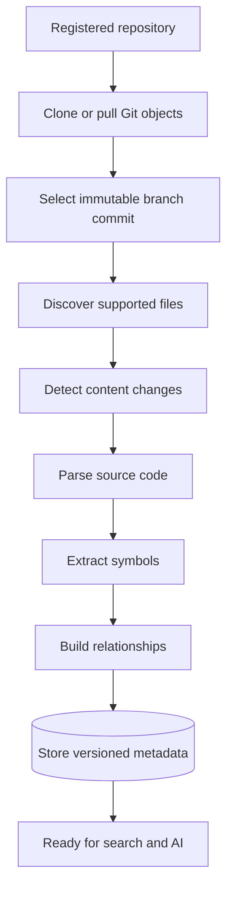

# CodeMind Product Roadmap

## Document information

Status: Active
Version: 2.0
Updated: 2026-08-01
Owner: CodeMind Engineering

## Vision

CodeMind is a software-intelligence platform that helps developers understand,
search, maintain, and evolve complex codebases.

The product goal is:

> Understand any codebase like a senior engineer, then make that understanding
> safely available to people and tools.

## Delivery principles

- Build durable repository understanding before adding AI generation.
- Keep organization scope explicit in every persisted and API resource.
- Process repositories as untrusted input and never execute repository code.
- Make long-running work resumable, observable, and idempotent.
- Preserve exact Git commit and content-version provenance.
- Add each downstream phase through stable module contracts.
- Ship migrations, tests, and documentation with each milestone.

## Phase overview

| Phase | Name | Outcome | Status |
|---:|---|---|---|
| 1 | Platform & Identity | Secure multi-tenant backend foundation | Complete |
| 2 | Repository Management | Register, share, synchronize, and inspect repositories | Complete |
| 3 | Indexing & Code Intelligence | Convert Git source into structured code metadata | In progress |
| 4 | Knowledge Graph & Business Logic | Convert code structure into navigable system knowledge | Planned |
| 5 | Search Engine | Retrieve precise lexical, symbol, graph, and semantic context | Planned |
| 6 | AI Assistant (RAG) | Answer and reason from retrieved CodeMind knowledge | Planned |
| 7 | MCP Server | Expose CodeMind safely to external AI tools | Planned |
| 8 | Enterprise & Observability | Operate securely at organizational scale | Future |

## Current checkpoint

Phases 1 and 2 are complete. Phase 3.1 defines the durable indexing job,
file inventory, content-version, and indexing-error foundation. The job API
creates an immutable branch/commit request and exposes status/history.

Phase 3.2 prepares isolated job workspaces and verifies the immutable commit in
the hardened Git object cache. Phase 3.3 scans that Git tree with centralized
ignore and resource policies and transactionally reconciles file inventory.
Phase 3.4 skips unchanged Git blobs and persists SHA-256 content versions for
changed files. Jobs currently remain `queued`; language detection, parsers,
graph construction, and the background worker remain.

Architecture decisions:

- [ADR-011: Secure Git Integration](../06-adrs/011-secure-git-integration.md)
- [ADR-012: Indexing Engine Architecture](../06-adrs/012-indexing-engine.md)

## Phase 1 — Platform & Identity

Goal: establish a secure modular NestJS and PostgreSQL platform.

Delivered:

- Validated environment configuration
- TypeORM migrations and database health checks
- Organization, user, role, and permission schema
- Transactional registration and Argon2id password hashing
- JWT access tokens and rotating refresh-token sessions
- Logout, refresh-reuse detection, and session-family revocation
- Permission guards and organization-scoped user administration
- Invitation acceptance and OWNER continuity rules
- Authentication audit records and rate limiting
- Unit and PostgreSQL E2E coverage

## Phase 2 — Repository Management

Goal: allow an organization to register, share, synchronize, and inspect Git
repositories.

Delivered:

- Repository, repository-member, and branch entities
- Tenant-scoped repository CRUD and membership APIs
- Repository permissions and cross-organization protection
- Hardened GitHub HTTPS and allow-listed local Git service
- Branch synchronization with persisted commit SHAs and deleted state
- Synchronization status, repository size, and health API
- Unit, authorization, and PostgreSQL E2E tests
- API, module, schema, and security documentation

Deferred provider work includes private credentials, GitLab/Bitbucket Git
execution, webhooks, and multi-host Git workspace distribution.

## Phase 3 — Indexing & Code Intelligence

Goal: transform a synchronized Git repository into a structured, searchable
metadata layer.

### Milestone status

| Milestone | Scope | Status |
|---:|---|---|
| 3.1 | Indexing foundation | Implemented; E2E regression deferred |
| 3.2 | Git workspace manager | Implemented; tests deferred |
| 3.3 | File discovery | Implemented; tests deferred |
| 3.4 | Incremental indexing | Implemented; tests and migration execution deferred |
| 3.5 | Language detection | Next |
| 3.6 | Parser engine | Planned |
| 3.7 | Symbol extraction | Planned |
| 3.8 | Dependency graph | Planned |
| 3.9 | Index job system | API foundation delivered early; lifecycle expansion planned |
| 3.10 | Background processing | Planned |
| 3.11 | Tests | Continuous; phase-level suite planned |
| 3.12 | Documentation | Continuous; completion review planned |

Phase 3 is complete when CodeMind can:

- Materialize an exact repository commit safely
- Scan supported source files with bounded resource use
- Detect unchanged, changed, new, and deleted files
- Parse TypeScript and JavaScript without executing source code
- Extract classes, functions, interfaces, enums, imports, and exports
- Build file/symbol dependency relationships
- Persist versioned metadata in PostgreSQL
- Track progress and terminal state through durable jobs

## Phase 4 — Knowledge Graph & Business Logic

Goal: turn structural code metadata into navigable system knowledge.

Planned capabilities:

- Resolved cross-file and cross-module graph
- Domain concepts and service/repository/controller relationships
- Business-rule and workflow extraction
- Architecture and module summaries with source provenance
- Change-impact paths and ownership context
- Generated documentation tied to code versions

## Phase 5 — Search Engine

Goal: retrieve the smallest, most relevant source-grounded context.

Planned capabilities:

- File, path, and text search
- Symbol and reference search
- Dependency and graph traversal
- PostgreSQL full-text retrieval
- Embeddings and vector retrieval when justified
- Hybrid ranking, filters, access control, and result provenance

## Phase 6 — AI Assistant (RAG)

Goal: provide grounded developer assistance from CodeMind retrieval.

Planned capabilities:

- Repository question answering
- Code and architecture explanation
- Impact analysis and migration assistance
- Source-cited answers
- Provider abstraction, context budgeting, and cost controls
- Conversation memory with organization/repository boundaries

AI output must not become the source of truth for code metadata. Retrieval is
built on versioned Phase 3–5 data.

## Phase 7 — MCP Server

Goal: expose CodeMind context to IDEs and external AI agents through controlled
tools and resources.

Planned capabilities:

- Repository, file, symbol, relationship, search, and documentation resources
- Permission-aware MCP tools
- Scoped authentication and audit records
- Rate, payload, and context limits
- Stable versioned contracts

## Phase 8 — Enterprise Features & Observability

Goal: operate CodeMind securely and reliably across large organizations.

Planned capabilities:

- SSO/SAML/OIDC, SCIM, and advanced policy controls
- Multi-organization administration and billing
- Job dashboards, traces, metrics, alerts, and SLOs
- Data retention, export, deletion, and legal-hold controls
- Queue and worker autoscaling
- Storage quotas and lifecycle management
- Backup, recovery, regional deployment, and compliance controls

## Definition of done for every milestone

A milestone is complete only when:

- Database changes are migration-backed with no schema drift.
- API and worker boundaries enforce tenant scope and permissions.
- Failure behavior is explicit and does not leak sensitive internals.
- Unit and integration/E2E coverage is proportional to risk.
- Module, API, database, and ADR documentation reflect implementation.
- Lint, build, tests, and migration checks pass.
