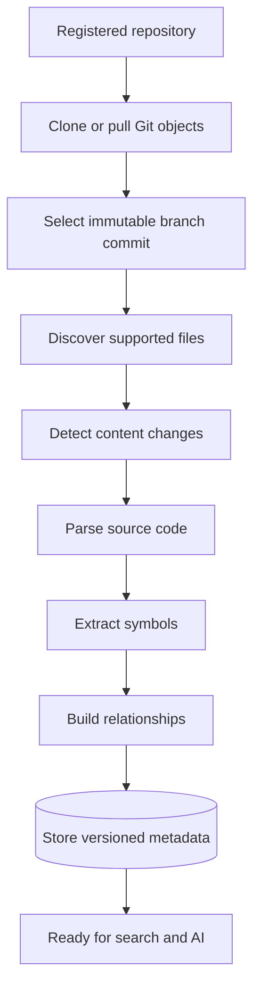
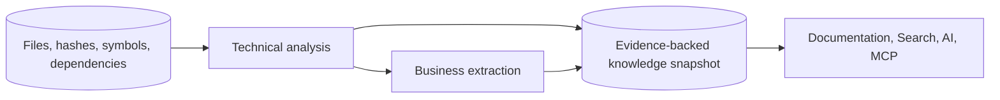

# CodeMind Product Roadmap

## Document information

Status: Active
Version: 2.3
Updated: 2026-09-26
Owner: CodeMind Engineering

## Vision

CodeMind is a software-intelligence platform that helps developers understand,
search, maintain, and evolve complex codebases.

The product goal is:

> Understand any codebase like a senior engineer, then make that understanding
> safely available to people and tools.

## Delivery principles

- Build durable repository understanding before adding AI generation.
- Keep organization scope explicit in every persisted and API resource.
- Process repositories as untrusted input and never execute repository code.
- Make long-running work resumable, observable, and idempotent.
- Preserve exact Git commit and content-version provenance.
- Add each downstream phase through stable module contracts.
- Ship migrations, tests, and documentation with each milestone.

## Phase overview

| Phase | Name                             | Outcome                                                       | Status      |
| ----: | -------------------------------- | ------------------------------------------------------------- | ----------- |
|     1 | Platform & Identity              | Secure multi-tenant backend foundation                        | Complete    |
|     2 | Repository Management            | Register, share, synchronize, and inspect repositories        | Complete    |
|     3 | Indexing & Code Intelligence     | Convert Git source into structured code metadata              | Complete    |
|     4 | Knowledge Graph & Business Logic | Convert code structure into navigable system knowledge        | In progress |
|     5 | Search Engine                    | Retrieve precise lexical, symbol, graph, and semantic context | Planned     |
|     6 | AI Assistant (RAG)               | Answer and reason from retrieved CodeMind knowledge           | Planned     |
|     7 | MCP Server                       | Expose CodeMind safely to external AI tools                   | Planned     |
|     8 | Enterprise & Observability       | Operate securely at organizational scale                      | Future      |

## Current checkpoint

Phases 1 through 3 are complete. Phase 3 established the durable indexing job,
file inventory, content-version, symbol, dependency, and indexing-error model.
The API creates an immutable branch/commit request and exposes status/history.

Phase 3.2 prepared isolated job workspaces and verified the immutable commit in
the hardened Git object cache. Phase 3.3 scans that Git tree with centralized
ignore and resource policies and transactionally reconciles file inventory.
Phase 3.4 skips unchanged Git blobs and persists SHA-256 content versions for
changed files. Phase 3.5 classifies TypeScript/JavaScript as parser-supported
and JSON/Markdown/YAML as inventory-only. Phase 3.6 parses bounded TS/TSX/JS/JSX
content into normalized syntax metadata without executing it. Phase 3.7 stores
version-scoped symbols with tenant-aware, retry-safe reconciliation. Phase 3.8
stores imports, exports, inheritance, and reliably resolved local targets.
Phase 3.9 added the durable job state machine, atomic claims, lease fencing,
heartbeats, progress, retry, cancellation, recovery, and terminal health
updates. Phase 3.10 executes that lifecycle through a PostgreSQL-backed worker,
including current-file progress, incremental completion markers, heartbeats,
cancellation checks, failure recording, and graceful shutdown. Milestone 3.11
verified the pipeline with service and PostgreSQL E2E coverage, and Milestone
3.12 reconciled the module, API, schema, parser, ADR, and roadmap documents.

Phase 4.1 now defines a PostgreSQL-first, immutable knowledge-snapshot model.
Technical analysis, business extraction, and knowledge publication have
separate contracts. Every published fact requires Phase 3 source evidence, and
Neo4j, embeddings, and AI-assisted facts remain deferred until their phases or
measured requirements justify them.

Milestone 4.2 now exports tenant-scoped Phase 3 snapshot and bounded immutable
source ports, defines normalized analyzer facts and diagnostics, and streams
deterministic TypeScript/JavaScript decorator, constructor-injection, and call
facts. Resource limits, stable fingerprints, evidence scope, stale-snapshot
detection, and explicit unresolved targets are covered by focused tests.

Milestone 4.3 now persists durable knowledge builds and invisible draft
snapshots with typed nodes, edges, evidence, and bounded errors. PostgreSQL
constraints enforce tenant and Phase 3 source scope, published content is
immutable, and one transaction validates evidence before publishing a snapshot
and conditionally selecting it as current. Public knowledge APIs are not
introduced yet.

Milestone 4.4 now classifies supported TypeScript/JavaScript architecture
components and resolves calls through local methods, constructor injection,
reliable Phase 3 imports, namespace targets, and inheritance. Module metadata
produces containment and dependency relationships. Every call retains an
explicit resolved, unresolved, or ambiguous result, and the Knowledge module
projects publishable component and relationship facts into the 4.3 persistence
contract.

Architecture decisions:

- [ADR-011: Secure Git Integration](../06-adrs/011-secure-git-integration.md)
- [ADR-012: Indexing Engine Architecture](../06-adrs/012-indexing-engine.md)
- [ADR-013: Parser Architecture](../06-adrs/013-parser-architecture.md)
- [ADR-014: Knowledge Analysis Architecture](../06-adrs/014-knowledge-analysis-architecture.md)

## Phase 1 — Platform & Identity

Goal: establish a secure modular NestJS and PostgreSQL platform.

Delivered:

- Validated environment configuration
- TypeORM migrations and database health checks
- Organization, user, role, and permission schema
- Transactional registration and Argon2id password hashing
- JWT access tokens and rotating refresh-token sessions
- Logout, refresh-reuse detection, and session-family revocation
- Permission guards and organization-scoped user administration
- Invitation acceptance and OWNER continuity rules
- Authentication audit records and rate limiting
- Unit and PostgreSQL E2E coverage

## Phase 2 — Repository Management

Goal: allow an organization to register, share, synchronize, and inspect Git
repositories.

Delivered:

- Repository, repository-member, and branch entities
- Tenant-scoped repository CRUD and membership APIs
- Repository permissions and cross-organization protection
- Hardened GitHub HTTPS and allow-listed local Git service
- Branch synchronization with persisted commit SHAs and deleted state
- Synchronization status, repository size, and health API
- Unit, authorization, and PostgreSQL E2E tests
- API, module, schema, and security documentation

Deferred provider work includes private credentials, GitLab/Bitbucket Git
execution, webhooks, and multi-host Git workspace distribution.

## Phase 3 — Indexing & Code Intelligence

Goal: transform a synchronized Git repository into a structured, searchable
metadata layer.

### Milestone status

| Milestone | Scope                 | Status                       |
| --------: | --------------------- | ---------------------------- |
|       3.1 | Indexing foundation   | Implemented; covered by 3.11 |
|       3.2 | Git workspace manager | Implemented; covered by 3.11 |
|       3.3 | File discovery        | Implemented; covered by 3.11 |
|       3.4 | Incremental indexing  | Implemented; covered by 3.11 |
|       3.5 | Language detection    | Implemented; covered by 3.11 |
|       3.6 | Parser engine         | Implemented; covered by 3.11 |
|       3.7 | Symbol extraction     | Implemented; covered by 3.11 |
|       3.8 | Dependency graph      | Implemented; covered by 3.11 |
|       3.9 | Index job system      | Implemented; covered by 3.11 |
|      3.10 | Background processing | Implemented; covered by 3.11 |
|      3.11 | Tests                 | Implemented                  |
|      3.12 | Documentation         | Complete                     |

Phase 3 delivers:

- Verify and read an exact repository commit safely without checkout
- Scan supported source files with bounded resource use
- Detect unchanged, changed, new, and deleted files
- Parse TypeScript and JavaScript without executing source code
- Extract classes, functions, interfaces, enums, imports, and exports
- Build file/symbol dependency relationships
- Persist versioned metadata in PostgreSQL
- Track progress and terminal state through durable jobs

## Phase 4 — Knowledge Graph & Business Logic

Goal: turn structural code metadata into navigable system knowledge.

Architecture flow:

Milestones:

| Milestone | Scope                                                                        | Status   |
| --------: | ---------------------------------------------------------------------------- | -------- |
|       4.1 | Architecture, module boundaries, provenance, snapshot, and storage decisions | Complete |
|       4.2 | Phase 3 read/source ports and technical analyzer contracts                   | Complete |
|       4.3 | Knowledge builds, snapshots, graph, evidence, entities, and migrations       | Complete |
|       4.4 | Call graph and architecture-component extraction                             | Complete |
|       4.5 | Domain concepts and evidence-backed business rules                           | Complete |
|       4.6 | Workflows, events, states, and transitions                                   | In progress |
|       4.7 | Tenant-scoped knowledge and evidence APIs                                    | Planned  |
|       4.8 | Background processing, retry, cancellation, and recovery                     | Planned  |
|       4.9 | Tests, performance/security verification, and documentation                  | Planned  |

Architecture decisions:

- Phase 3 remains the structural source of truth.
- PostgreSQL adjacency tables are the first graph store.
- Knowledge snapshots are immutable and commit scoped.
- Every node and edge requires source evidence.
- Deterministic analyzers precede AI-assisted enrichment.
- Business extraction begins as an analysis subdomain, not another NestJS
  module.

Planned capabilities:

- Resolved cross-file and cross-module graph
- Domain concepts and service/repository/controller relationships
- Business-rule and workflow extraction
- Architecture and module summaries with source provenance
- Change-impact paths and ownership context
- Generated documentation tied to code versions

Canonical Phase 4 documents:

- [Analysis module](../02-core-modules/analysis.md)
- [Business extraction engine](../02-core-modules/business-engine.md)
- [Knowledge module](../02-core-modules/knowledge.md)
- [Knowledge graph schema](../03-database/knowledge-graph-schema.md)
- [ADR-014](../06-adrs/014-knowledge-analysis-architecture.md)

## Phase 5 — Search Engine

Goal: retrieve the smallest, most relevant source-grounded context.

Planned capabilities:

- File, path, and text search
- Symbol and reference search
- Dependency and graph traversal
- PostgreSQL full-text retrieval
- Embeddings and vector retrieval when justified
- Hybrid ranking, filters, access control, and result provenance

## Phase 6 — AI Assistant (RAG)

Goal: provide grounded developer assistance from CodeMind retrieval.

Planned capabilities:

- Repository question answering
- Code and architecture explanation
- Impact analysis and migration assistance
- Source-cited answers
- Provider abstraction, context budgeting, and cost controls
- Conversation memory with organization/repository boundaries

AI output must not become the source of truth for code metadata. Retrieval is
built on versioned Phase 3–5 data.

## Phase 7 — MCP Server

Goal: expose CodeMind context to IDEs and external AI agents through controlled
tools and resources.

Planned capabilities:

- Repository, file, symbol, relationship, search, and documentation resources
- Permission-aware MCP tools
- Scoped authentication and audit records
- Rate, payload, and context limits
- Stable versioned contracts

## Phase 8 — Enterprise Features & Observability

Goal: operate CodeMind securely and reliably across large organizations.

Planned capabilities:

- SSO/SAML/OIDC, SCIM, and advanced policy controls
- Multi-organization administration and billing
- Job dashboards, traces, metrics, alerts, and SLOs
- Data retention, export, deletion, and legal-hold controls
- Queue and worker autoscaling
- Storage quotas and lifecycle management
- Backup, recovery, regional deployment, and compliance controls

## Definition of done for every milestone

A milestone is complete only when:

- Database changes are migration-backed with no schema drift.
- API and worker boundaries enforce tenant scope and permissions.
- Failure behavior is explicit and does not leak sensitive internals.
- Unit and integration/E2E coverage is proportional to risk.
- Module, API, database, and ADR documentation reflect implementation.
- Lint, build, tests, and migration checks pass.
