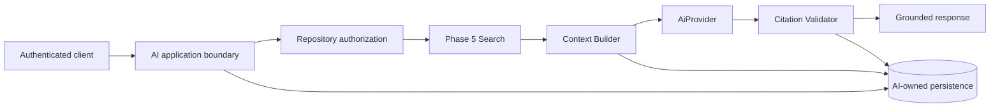

# ADR-005: AI Assistant and RAG Architecture

## Status

Accepted

## Date

2026-09-29

## Context

Phases 3 and 4 produce immutable, commit-scoped code intelligence and published
knowledge. Phase 5 projects that information into a permission-scoped Search
API with exact, lexical, filtered, and graph-aware retrieval.

Phase 6 must use those capabilities to answer developer questions without
sending an entire repository to a model, bypassing repository permissions, or
allowing generated text to become authoritative metadata.

The earlier AI draft coupled RAG to embeddings and `pgvector`, allowed the AI
layer to retrieve from several lower-level modules, and treated model-emitted
paths, confidence, and citations as trustworthy. Those choices are unnecessary
for the first release and weaken module and security boundaries.

## Decision

CodeMind will implement a retrieval-augmented AI assistant with this division
of responsibility:

```text
Phase 5 Search retrieves evidence.
Phase 6 AI selects bounded context and reasons over that evidence.
```

The first RAG version will use the existing Phase 5 exact, lexical, filtered,
and graph-aware retrieval pipeline. Embeddings and `pgvector` are deferred until
evaluation shows a measurable retrieval-quality gap.

The AI module will depend on an exported Search application contract and
repository authorization services. It will not read Indexing, Knowledge, or
Search persistence tables directly. Lower-level modules will not depend on AI.

## Security invariant

The LLM must never receive repository information that was not authorized and
retrieved through CodeMind's controlled retrieval pipeline.

This invariant applies to initial questions, follow-up turns, retries,
background work, provider fallbacks, evaluation jobs, and future MCP exposure.

## Architecture



No provider call occurs until organization, repository, branch, and permission
scope are verified and the context budget has accepted the selected evidence.

## Application-owned contracts

### `AiRequest`

Represents authenticated user intent for one question. Organization and user
scope are supplied by the authentication boundary, not trusted from a request
body. It may reference a repository, branch, and existing conversation, but it
cannot provide credentials, raw prompts, provider base URLs, or unbounded
retrieval controls.

### `AiRun`

Represents the persisted execution of one request, including lifecycle,
immutable retrieval scope, context manifest, provider/model, attempts, usage,
failure category, timings, and completion result. `AiRequest` is input;
`AiRun` is the auditable execution record.

### `Conversation` and `Message`

A conversation is organization- and repository-scoped. Messages model user and
assistant turns. Conversation membership never replaces authorization: every
new turn revalidates current repository access. Assistant messages link to the
run that generated them.

### `RetrievedContext`

Represents one server-selected Search result included in a provider request. It
retains search-index, commit, source identity, path/type metadata, bounded
content, score, and token estimate. The server assigns a citation key such as
`S1`; neither clients nor providers can create trusted context records.

### `SourceCitation`

Represents a validated link from answer text to one context item. CodeMind
constructs public citations from trusted retrieval metadata after confirming
that a provider-returned citation key exists in the exact run manifest.

### `ContextBuilder`

Deterministically deduplicates, orders, bounds, labels, and token-budgets Search
results and permitted conversation history. Repository content is treated as
untrusted evidence and cannot override system instructions or security policy.

### `TokenBudget`

Reserves the model context window across system instructions, question,
conversation history, retrieved evidence, output allowance, and a safety
margin. Local estimates protect the request before generation; provider usage
is recorded after generation.

### `AiProvider`

An application-owned model interface. Adapters accept only prepared
instructions, a bounded context envelope, output schema, and execution limits.
They do not receive Search services, database connections, access tokens, Git
credentials, or authorization capabilities. Provider-specific types remain
inside adapters.

## Dependency rules

Allowed:

```text
AI → Repository authorization
AI → Search application contract
AI → AI-owned persistence
AI → configured AiProvider adapter
AI API / Phase 7 MCP → AI application service
```

Forbidden:

```text
Search / Knowledge / Indexing / Repositories → AI
AI → Phase 3–5 repositories or tables
Provider adapter → Search, Git, database, or authorization
Client → provider credentials, system prompts, or tenant scope
```

## Retrieval decision

Version 1 queries the current published Phase 5 search index using bounded
exact, lexical, filtered, and graph-aware retrieval. AI consumes Search ranking
and provenance rather than reimplementing retrieval.

If Search returns no defensible evidence, the run ends with an
insufficient-evidence result. The model is not called with an empty or invented
repository context.

Embedding retrieval may be added later only when a versioned evaluation set
shows that it materially improves recall or answer quality. It must remain an
additional Phase 5 retrieval signal with the same authorization, provenance,
publication, and lifecycle rules.

## Context and prompt decision

The context builder will:

1. pin a run to the Search result's immutable index and commit;
2. deduplicate by source identity;
3. apply stable rank order and configured diversity policy;
4. enforce per-source, total-byte, and total-token limits;
5. reserve output tokens and a safety margin before selection;
6. assign citation keys and create a context manifest;
7. delimit repository text as untrusted evidence;
8. include only bounded, currently authorized conversation history.

System instructions remain application owned and versioned. Users cannot
replace them, and source text cannot modify them. Prompts may live in source or
versioned configuration; a prompt-management database is not required for the
first release.

## Citation decision

The model returns structured answer content and citation keys. CodeMind validates
those keys against the run manifest and builds public citations from trusted
metadata. Model-emitted paths, line ranges, source IDs, or confidence values are
not accepted as authoritative.

Every grounded response identifies the search index and target commit used. An
answer without a valid citation cannot be represented as fully grounded. Any
future confidence score must be computed from explicit retrieval/validation
signals rather than a free-form model percentage.

## Provider decision

Provider selection is controlled by validated server configuration. The
existing `AI_PROVIDER`, `AI_MODEL`, `AI_API_KEY`, and `AI_BASE_URL` variables
are bootstrap settings; provider enablement also requires explicit limits for
timeouts, retries, context, output tokens, and cost.

All adapters must support:

- an application-owned request and response contract;
- timeout and abort propagation;
- structured output validation;
- normalized usage and finish reasons;
- sanitized error mapping;
- bounded transient retry behavior;
- idempotent persistence around attempts.

Clients cannot select arbitrary provider endpoints, API keys, or unrestricted
models. Provider credentials, raw prompts, source content, and full answers are
excluded from ordinary logs.

## Conversation decision

Conversation history provides bounded continuity, not long-term global memory.
Every turn retrieves fresh repository evidence and rechecks authorization. A
prior assistant answer is not evidence. Stored citations preserve the original
search index and commit, even after a branch advances.

Cross-repository conversation memory, behavioral user profiles, autonomous
agents, and learned long-term memory are deferred.

## Failure and retry decision

Application-owned failure categories distinguish invalid requests,
authorization failures, missing Search prerequisites, insufficient evidence,
budget failures, provider rate limits, provider timeouts, provider server
failures, invalid provider output, and cancellation.

Validation, authorization, insufficient-evidence, budget, and output-schema
failures are not retried. Configured transient provider failures may receive a
small bounded retry with timeout and cancellation propagation. Retrying must not
create duplicate assistant messages or hide additional billable attempts.

## Persistence decision

Milestone 6.2 will design AI-owned tables for conversations, messages, runs,
attempts, context manifests, citations, and usage. The schema must preserve
tenant/repository scope and immutable search-index/commit provenance.

The database will not store another authoritative copy of repository code or
knowledge. Retention and redaction policy must be explicit before raw prompt or
answer content is persisted.

## Alternatives considered

### Direct whole-repository prompting

Rejected because it is expensive, unbounded, difficult to authorize precisely,
and incompatible with large repositories and reproducible citations.

### Embeddings and `pgvector` as a prerequisite

Deferred because Phase 5 already provides measurable exact, lexical, filtered,
and graph-aware retrieval. Adding vectors before evaluation would add model,
dimension, lifecycle, cost, and migration concerns without proven benefit.

### AI querying Indexing and Knowledge directly

Rejected because it duplicates Search ranking and filtering, breaks module
boundaries, and creates additional tenant-security paths.

### Provider-managed retrieval or uploaded repository stores

Rejected because repository scope, retention, deletion, provenance, and access
control would leave CodeMind's authoritative boundary.

### Single-provider service types throughout the module

Rejected because provider request/response objects would couple orchestration,
persistence, APIs, and tests to one vendor.

### Fine-tuning repository content

Deferred because repository knowledge changes frequently, provenance is weak,
revocation is difficult, and retrieval already supplies current evidence.

## Consequences

Positive:

- Phase 6 can start with the completed Phase 5 system.
- Authorization and source provenance remain inside CodeMind.
- Provider adapters can change without rewriting orchestration or persistence.
- Token and cost limits are enforced before generation.
- Answers can be traced to an immutable search index and commit.
- Embeddings remain an evidence-driven optimization instead of a dependency.

Negative:

- Context construction and citation validation add application complexity.
- Lexical/graph retrieval may miss conceptual matches until evaluation supports
  an additional semantic signal.
- Provider-neutral token estimation is approximate and requires safety margin.
- Conversation retention and provider privacy policies require explicit
  operational decisions in later milestones.
- Answer quality requires a maintained evaluation corpus, not only unit tests.

## Follow-on milestones

| Milestone | Implementation                                             |
| --------: | ---------------------------------------------------------- |
|       6.2 | AI entities, constraints, migration, and retention fields  |
|       6.3 | `AiProvider` contract, configuration limits, first adapter |
|       6.4 | Search retrieval adapter, context builder, token budgeting |
|       6.5 | Run orchestration, generation, and citation validation     |
|       6.6 | Permission-scoped conversation and query APIs              |
|       6.7 | Repository assistant web experience                        |
|       6.8 | Evaluation corpus, security tests, and operational gates   |

## References

- [AI Assistant module](../02-core-modules/ai.md)
- [Search module](../02-core-modules/search.md)
- [Search strategy](006-search-strategy.md)
- [Phase milestones](../05-roadmap/milestones.md)
