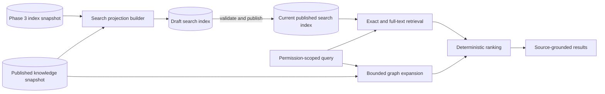

# ADR-006: Search Strategy

## Status

Accepted for Phase 5

## Date

2026-09-28

## Context

Phase 3 produces commit-scoped files, content hashes, symbols, and structural
dependencies. Phase 4 publishes immutable knowledge snapshots containing
architecture, domain, rule, workflow, state, and event facts with source
evidence.

Search must retrieve a small, relevant, explainable subset of that information
without reading an entire repository on every request. Results must remain
organization scoped and tied to the exact commit from which they were derived.

The earlier search draft proposed keyword, vector, and graph systems at once.
That would introduce multiple ranking systems and another database before the
product has measured retrieval quality or scale requirements.

## Decision

CodeMind will build search incrementally around a versioned search projection.

1. PostgreSQL is the initial search engine.
2. Each searchable file, symbol, or knowledge node becomes a bounded
   `search_document`.
3. Documents belong to an immutable `search_index` tied to one published
   knowledge snapshot, successful indexing job, branch, and commit.
4. Draft search indexes are invisible. A complete index is published
   atomically, and only one published index may be current per branch.
5. Initial retrieval combines exact identifier/path matching and PostgreSQL
   full-text search using the `simple` text-search configuration.
6. Symbol and graph signals are read from Phase 3 and Phase 4 through module
   services; Search does not create a second authoritative code graph.
7. Ranking is deterministic and returns source type, commit, path, source IDs,
   and score explanations.
8. Embeddings and `pgvector` are deferred until lexical and graph retrieval
   have an evaluation baseline proving that semantic retrieval adds value.

## Architecture

## Version and publication model

A search index records:

- organization, repository, and branch
- successful source index job
- published knowledge snapshot
- target commit SHA
- search indexer version and configuration digest
- draft/published state and document count

Documents can be written or replaced while their index is a draft. Publishing
validates the document count and makes the projection immutable. If the branch
moved or the knowledge snapshot is no longer current, the search index may be
kept as historical but cannot become current.

This prevents a failed rebuild from replacing a working search index and makes
search results reproducible.

## Retrieval stages

### Initial stages

- Exact, case-normalized title and identifier lookup
- Path lookup
- Weighted PostgreSQL full-text retrieval
- Repository, branch, language, kind, and source-type filters
- Symbol metadata and bounded knowledge-graph expansion
- Stable score fusion and result deduplication

### Deferred semantic stage

Embeddings may be added as a separate derived projection. Before adoption, the
team must define an evaluation set, measure recall and ranking improvement,
set embedding/version lifecycle rules, and document cost and retention.
Embeddings never replace source provenance or permission checks.

## Security and limits

- Every build and query is explicitly organization/repository/branch scoped.
- Search projections never grant access; repository authorization is checked
  before retrieval.
- Source content is treated as untrusted data and is never executed.
- Document content and JSON metadata have database-enforced byte limits.
- Result counts, query length, graph depth, context bytes, and execution time
  must be bounded by the application layer.
- Errors and logs must not contain repository source or credentials.

## Alternatives considered

### Elasticsearch/OpenSearch first

Rejected for the initial release because it adds another operational system,
index lifecycle, and tenant-security boundary before PostgreSQL limits have
been measured.

### Vector-only search

Rejected because identifiers, paths, and code symbols require exact lexical
precision, and vector similarity alone is difficult to explain and reproduce.

### Query Phase 3 and Phase 4 tables directly

Rejected as the only strategy because heterogeneous rows are expensive to
rank consistently. A derived projection gives one bounded retrieval contract
while preserving foreign-key provenance to authoritative records.

### Mutable search rows per branch

Rejected because readers could observe partial rebuilds and results would not
be reproducible after a branch advances.

## Consequences

- Phase 5 can ship useful search without a new database service.
- Publication and rollback behavior match the proven knowledge-snapshot model.
- PostgreSQL storage increases because searchable text is materialized.
- Search indexing must be rerun when the indexer version or configuration
  changes.
- Semantic retrieval remains an additive future capability rather than a
  prerequisite for the search API.
