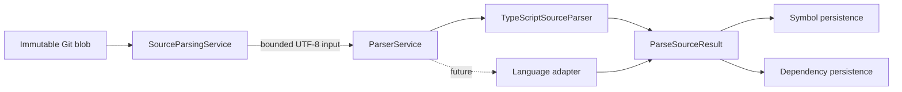

# ADR-013: Language-Specific Parser Architecture

## Status

Accepted

## Date

2026-08-17

## Context

CodeMind must convert untrusted source files into a stable representation of
declarations and relationships. TypeScript and JavaScript are the first
supported languages, but the indexing engine must be able to add Python, Java,
Go, PHP, C#, or other languages without coupling workers and persistence to a
specific parser library.

Parser libraries expose different AST shapes, source positions, diagnostics,
and runtime behavior. Allowing those library-specific objects to cross module
boundaries would make indexing, storage, search, and AI features depend on the
first implementation choice.

The parser boundary must also preserve CodeMind's repository security model:
repository code is input data and must never be imported, compiled, or
executed as part of indexing.

## Decision

CodeMind uses a language-specific parser port with a normalized result model.
`ParserService` selects an adapter using detected language and file extension.
Each adapter implements `SourceParser`:

```typescript
interface SourceParser {
  supports(input: Pick<ParseSourceInput, 'language' | 'extension'>): boolean;

  parse(input: ParseSourceInput): Promise<ParseSourceResult>;
}
```

The first adapter is `TypeScriptSourceParser`, backed by the TypeScript Compiler
API for `.ts`, `.tsx`, `.js`, and `.jsx`. The `typescript` package is therefore
a runtime dependency, not only a development dependency.



## Boundary ownership

The indexing module owns `SourceParsingService`. It validates the job, commit,
file, hash, Git blob identity, persisted byte size, configured byte limit, and
UTF-8 content before invoking the parser.

The parser module owns:

- Adapter selection
- Language syntax traversal
- Normalized source ranges
- Symbols, imports, exports, inheritance relationships, and diagnostics
- Parser-specific error normalization

The parser module does not own:

- Git access or workspaces
- TypeORM entities, queries, or transactions
- Job lifecycle and retries
- Tenant authorization
- Symbol or dependency persistence
- Search, embeddings, or AI generation

This dependency direction is required:

```text
Indexing module -> Parser module
Parser module   -X-> Indexing, repositories, TypeORM, HTTP
```

## Normalized model

`ParseSourceInput` carries only stable file identity and bounded source text:

- Indexed-file ID
- Immutable file-hash ID
- Normalized repository-relative path
- Detected language
- Extension/dialect
- UTF-8 source content

`ParseSourceResult` returns plain data:

- Classes, interfaces, functions, methods, enums, and type aliases
- Visibility and export state
- Bounded signatures and documentation summaries
- Imports and exports
- `extends` and `implements` relationships
- One-based line/column and zero-based offset ranges
- Syntax diagnostics and a syntax-error flag

Compiler AST nodes, source-file objects, symbols from a language library, and
TypeORM entities must not appear in the contract. This keeps persisted and
downstream models stable if the internal parser changes.

## Safety and failure behavior

Adapters parse source text only. They must never:

- Import or require repository modules
- Execute package scripts, compilers, build tools, hooks, or tests
- Resolve dependencies by running repository code
- Access paths supplied directly by repository content
- Return raw source bodies through API responses

TypeScript syntax diagnostics are normalized and may be persisted alongside
useful partial syntax metadata. Unsupported language/extension combinations,
invalid source identity, oversized or non-UTF-8 blobs, parser failures, and
persistence failures are operational errors owned by the indexing job. The
current worker records the failure and applies the job retry policy; it does
not silently discard a failed parser file.

## Adding another language

A new adapter must:

1. Add language and extension capability to the centralized indexing registry.
2. Implement `SourceParser` without changing the normalized contract.
3. Register the adapter with `ParserService`.
4. Enforce the same bounded-input and no-execution rules.
5. Map native node kinds and positions into CodeMind enums and ranges.
6. Add service fixtures for valid, malformed, and unsupported input.
7. Add an indexing pipeline fixture before the language is marked supported.

Tree-sitter or a language-native parser may be used inside a future adapter.
Its node types must remain private to that adapter.

## Alternatives considered

### Expose the TypeScript AST

Rejected because it would couple persistence and later phases to TypeScript
compiler versions and would not provide a language-neutral contract.

### Put parsing directly in the indexing worker

Rejected because orchestration, syntax traversal, retries, and persistence
would become one large component that is difficult to test or extend.

### Use one universal parser immediately

Rejected because no single parser provides equally strong, maintained support
and semantics for every target language. A common port with specialized
adapters gives a stable platform boundary without forcing one implementation.

### Persist parser output directly from adapters

Rejected because parser adapters would need tenant, lease, transaction, and
schema knowledge. Indexing-owned persistence services must retain those rules.

## Consequences

Benefits:

- New language adapters can evolve independently.
- Indexing and downstream modules consume a stable normalized model.
- Parser code is testable without Git, PostgreSQL, or Nest controllers.
- Repository source remains untrusted data and is never executed.
- TypeScript/JavaScript share one mature parser while preserving TSX/JSX
  dialect selection.

Trade-offs:

- Normalization loses some language-specific AST detail.
- Advanced semantic relationships require a later, bounded semantic-analysis
  design rather than leaking compiler internals now.
- Each new language needs explicit mapping and conformance tests.
- Very large files remain constrained by indexing limits even when a parser
  library could technically accept them.

## Verification

Milestone 3.11 verifies TypeScript declarations and relationships,
JavaScript/JSX dispatch, malformed-source diagnostics, unsupported languages,
bounded immutable blob reads, symbol normalization, dependency extraction, and
the complete PostgreSQL-backed indexing pipeline.

This decision refines the parser portion of
[ADR-012](012-indexing-engine.md) and is the authority for future parser
adapters.
