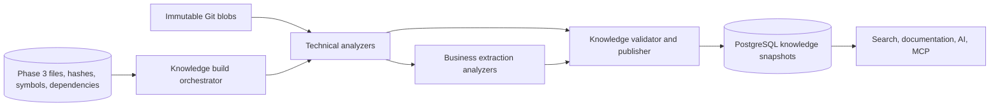
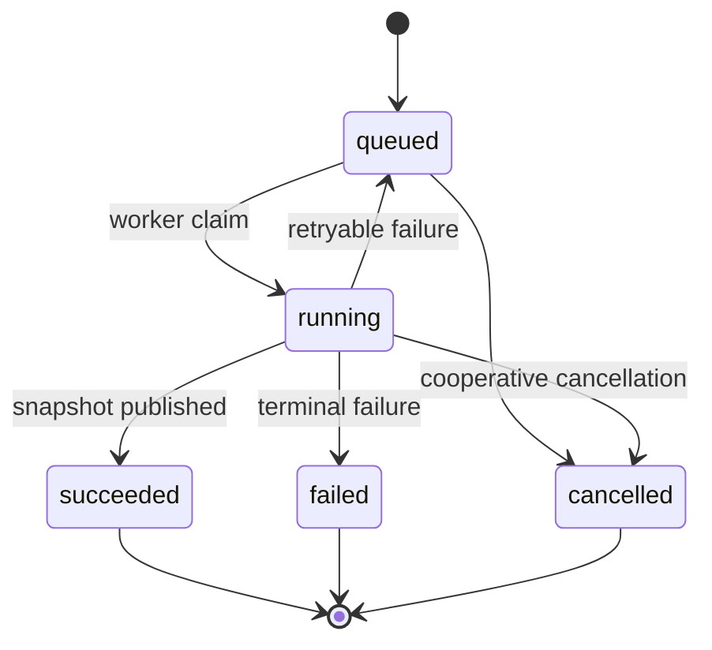
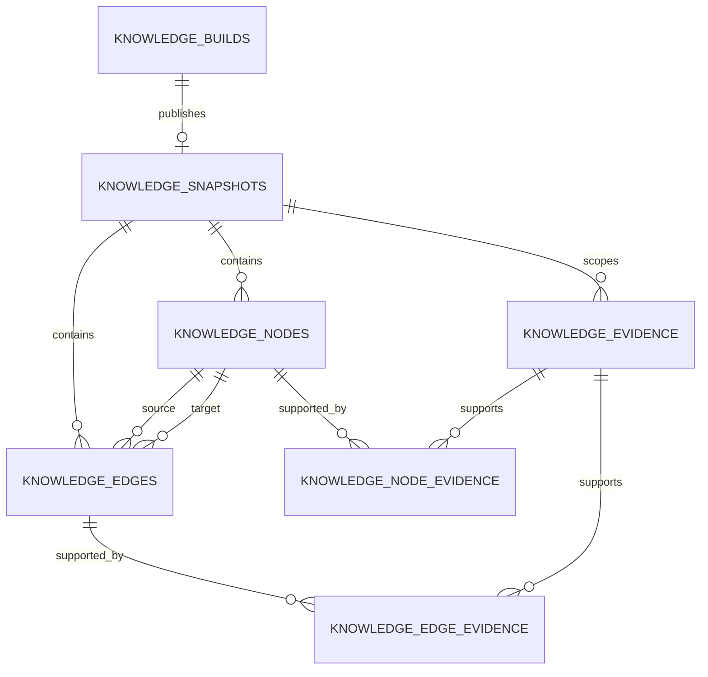

# ADR-014: Knowledge Analysis Architecture

## Status

Accepted for Phase 4

## Date

2026-08-17

## Context

Phase 3 gives CodeMind a reproducible structural view of a repository:

- Immutable indexing jobs tied to a branch and commit
- Active and deleted file inventory
- Immutable file-content versions
- TypeScript/JavaScript symbols and source ranges
- Import, export, `extends`, and `implements` relationships

Phase 4 must turn that structural metadata into architecture, domain concepts,
business rules, workflows, state transitions, and other reusable knowledge.
The result must remain explainable: CodeMind should always be able to show why
it believes a fact and which immutable source version supports it.

The existing concept drafts predate the Phase 3 implementation. They propose
tables that duplicate `indexed_files`, `code_symbols`, and
`code_dependencies`, mix technical facts with generated prose, and assume
Neo4j and vector storage before query requirements are known.

## Decision summary

CodeMind will:

1. Treat Phase 3 metadata as the structural source of truth and never copy it
   into replacement `code_entities` tables.
2. Separate technical analysis, business extraction, and knowledge
   persistence through explicit module contracts.
3. Build knowledge as immutable, commit-scoped snapshots.
4. Require source evidence and derivation metadata for every published node
   and edge.
5. Store the first knowledge graph in PostgreSQL using typed adjacency tables.
6. Prefer deterministic and explainable analyzers before AI-assisted
   enrichment.
7. Run knowledge generation outside HTTP requests through a durable build
   lifecycle.
8. Expose stable knowledge APIs rather than raw database tables.

## Architecture



Repository source remains untrusted input. Analysis may parse bounded immutable
blobs, but it must not import modules, execute scripts, run builds, load
repository plugins, or call repository-controlled tools.

## Module ownership

### Analysis module

The `AnalysisModule` derives technical facts from a Phase 3 snapshot.

It owns:

- Read-only Phase 3 intelligence access through an exported query port
- Bounded immutable-source access through an exported source port
- Call-site, decorator, constructor-injection, state-change, condition, and
  architecture-pattern analyzers
- Analyzer contracts, versions, diagnostics, and bounded fact streams
- Deterministic and heuristic confidence classification

It does not own knowledge tables, public knowledge APIs, generated prose,
search ranking, embeddings, or AI provider calls.

### Business extraction boundary

Business extraction starts as a logical analyzer family inside the analysis
module rather than a separate NestJS module. This preserves the existing module
graph and avoids a dependency cycle.

It owns normalized derivation of:

- Domain concepts
- Business rules and constraints
- Workflow steps and transitions
- Domain events and handlers
- Evidence-backed business relationships

If business extraction later requires a separate deployment or lifecycle, it
may be split behind the same fact-producer contract without changing knowledge
persistence.

### Knowledge module

The `KnowledgeModule` owns the durable product view.

It owns:

- Knowledge build orchestration and lifecycle
- Snapshot validation and atomic publication
- Node, edge, evidence, and derivation persistence
- Current-snapshot selection
- Tenant-scoped knowledge queries
- Review state for future human-confirmed or rejected facts

It consumes analysis contracts. The analysis module never imports the
knowledge module.

### Downstream modules

Documentation, search, AI, and MCP consume published knowledge through a
read-only knowledge service or API. They must not query knowledge entities
directly or convert generated AI text into authoritative facts.

Required dependency direction:

```text
Indexing read/source ports -> Analysis contracts -> Knowledge module
                                      |
                                      `-> Business analyzer family

Knowledge read service -> Documentation / Search / AI / MCP
```

## Knowledge build lifecycle

Knowledge generation is not part of the indexing HTTP request. A build targets
one successful index job and its immutable commit.



Durable status remains separate from the detailed phase:

```text
queued -> preparing -> analyzing -> validating -> publishing -> finished
```

The Phase 4 worker should reuse the proven PostgreSQL claim, lease, heartbeat,
retry, cancellation, and recovery pattern from indexing. It must use separate
knowledge-build tables and lifecycle services so indexing history is not
overloaded with another type of work.

A successful build publishes a snapshot atomically. Partial nodes and edges are
never visible to readers. If a branch advances during analysis, the completed
snapshot remains valid for its commit but becomes current only when the branch
still points to that commit.

## Snapshot and version model

Every build records:

- Organization, repository, and branch
- Source index-job ID and target commit SHA
- Analyzer bundle version
- Configuration digest
- Trigger and requesting user when applicable
- Status, phase, progress, attempts, and bounded failure details

Every published snapshot is immutable. Re-running analyzers with a new version
creates another snapshot instead of rewriting historical knowledge. Only one
snapshot may be current for a branch.

Stable comparison uses a deterministic `identity_key` for each fact. Database
IDs remain auto-increment integers and are not exposed as cross-snapshot
identity.

## PostgreSQL-first graph model

The first persistence model is:



Planned core tables:

- `knowledge_builds`: durable background work and target identity
- `knowledge_snapshots`: immutable published graph versions
- `knowledge_nodes`: typed architecture, domain, rule, workflow, state, and
  event facts
- `knowledge_edges`: typed directed relationships between nodes
- `knowledge_evidence`: immutable file/hash/symbol/range provenance
- `knowledge_node_evidence`: node-to-evidence links
- `knowledge_edge_evidence`: edge-to-evidence links
- `knowledge_build_errors`: sanitized build/analyzer failures

Core node and edge columns remain relational and indexed. A bounded `properties`
JSONB value may hold kind-specific attributes, but each node/edge kind must
have a versioned validation schema. JSONB is not a substitute for tenant,
snapshot, identity, kind, confidence, or provenance columns.

PostgreSQL recursive CTEs are sufficient for the first bounded graph traversals.
Neo4j is deferred until measured traversal depth, latency, volume, and
operational requirements show PostgreSQL is insufficient. Embeddings and vector
storage belong to Phase 5 search, not the authoritative Phase 4 graph.

## Fact kinds

The initial normalized node families are:

- Architectural component: module, controller, service, repository, entity,
  provider, configuration
- Domain concept: named business noun or bounded context
- Business rule: condition, constraint, validation, calculation, or permission
- Workflow and workflow step
- State and state transition
- Domain event and event handler

Initial edge families include:

- `contains`
- `depends_on`
- `calls`
- `handles`
- `represents`
- `enforces`
- `triggers`
- `precedes`
- `transitions_to`

Phase 3 import/export/inheritance rows remain structural evidence. They are not
duplicated as knowledge edges unless an analyzer derives a higher-level fact,
such as one architectural component depending on another.

## Evidence and derivation

Every published node and edge requires at least one evidence record. Evidence
references:

- Indexed file ID
- Immutable file-hash ID
- Code symbol ID when applicable
- One-based line/column and zero-based offset range when applicable
- Evidence role, such as declaration, condition, call site, assignment, or
  configuration

Evidence stores location and identity, not a copy of raw source. Authorized
consumers may resolve a bounded excerpt from the immutable commit later.

Each fact also records:

- Analyzer name and version
- Derivation type: `deterministic`, `heuristic`, `ai_assisted`, or
  `human_confirmed`
- Confidence between zero and one
- A stable identity key and content fingerprint
- Optional bounded, schema-validated properties

AI-assisted facts are future work. They must be labeled, evidence-backed, and
reviewable. AI output cannot overwrite deterministic facts or become the source
of truth without an explicit confirmation workflow.

## Tenant and security rules

- Organization scope is repeated on high-volume knowledge tables.
- Every build, snapshot, node, edge, and evidence query includes organization
  and repository scope.
- Cross-organization identifiers return `404` through public APIs.
- Evidence targets must belong to the same organization, repository, branch,
  index job, and commit snapshot.
- Source content, credentials, raw Git errors, and stack traces are not stored
  in knowledge facts or returned by APIs.
- Analyzer limits bound files, symbols, facts, edges, recursion depth, payload
  size, runtime, and memory-sensitive batches.

## Public API boundary

Phase 4 APIs will expose stable product concepts, for example current snapshot,
architecture components, domain concepts, rules, workflows, and evidence.
They will not expose generic SQL table CRUD.

Query results must include snapshot commit, confidence, derivation type, and
evidence summaries so a client can distinguish deterministic structure from an
inferred business interpretation.

## Alternatives considered

### Copy Phase 3 into generic code-entity tables

Rejected because it creates two structural sources of truth and makes current
file/symbol/dependency identity ambiguous.

### Neo4j from the first milestone

Rejected because it adds another database, backup model, authorization path,
and consistency problem before graph query requirements are measured.

### Vector database as the knowledge store

Rejected because similarity indexes are retrieval projections, not durable
typed facts or provenance. Vector retrieval remains a Phase 5 concern.

### AI-generated knowledge first

Rejected because it is expensive, difficult to reproduce, and unsafe without a
deterministic evidence model. AI enrichment may be layered on later.

### Store only generated prose

Rejected because prose is difficult to query, compare, validate, or trace.
Structured facts are authoritative; explanations are derived views.

### Separate business NestJS module immediately

Rejected for the first slice because business extraction consumes the same
snapshot, analyzers, limits, and lifecycle as technical analysis. A logical
analyzer boundary is enough until independent scaling is justified.

## Consequences

Benefits:

- One structural source of truth remains in Phase 3.
- Every knowledge result is commit-scoped and explainable.
- PostgreSQL transactions can publish a complete graph atomically.
- Analyzer and persistence code can evolve independently.
- Future search and AI phases receive typed facts with provenance.
- Storage complexity grows only when measurements justify it.

Trade-offs:

- Snapshot-scoped graph rows consume more storage than mutable latest-only
  records.
- PostgreSQL recursive graph queries require explicit depth and result limits.
- Deterministic business extraction will initially recognize only supported
  patterns and languages.
- Analyzer-version upgrades create new snapshots that need retention policy.
- Human review and AI-assisted enrichment require later workflow design.

## Phase 4 delivery mapping

| Milestone | Outcome                                                                   |
| --------: | ------------------------------------------------------------------------- |
|       4.1 | Architecture, boundaries, provenance, snapshot, and storage decisions     |
|       4.2 | Read-only Phase 3 snapshot ports and technical analyzer contracts         |
|       4.3 | Durable knowledge builds, snapshots, graph, evidence, and migrations      |
|       4.4 | Call graph and architecture-component extraction                          |
|       4.5 | Domain concepts and evidence-backed business rules                        |
|       4.6 | Workflows, events, states, and transitions                                |
|       4.7 | Tenant-scoped knowledge and evidence APIs                                 |
|       4.8 | Background processing, retries, cancellation, and publication recovery    |
|       4.9 | Unit, PostgreSQL E2E, performance, security, and documentation completion |

## Phase 4 verification outcome

Milestone 4.9 confirms this decision with service/analyzer coverage and a
real-PostgreSQL suite. The database suite exercises the claimed processor,
lifecycle transitions, retry-idempotent persistence, identity conflict
rollback, evidence and tenant isolation, draft exclusion, immutable
publication, branch movement, and a bounded 100-node/99-edge graph batch.

Phase 4 is complete. Lexical, graph, and semantic retrieval over the published
knowledge boundary proceeds in Phase 5 without changing Phase 3 structural
truth or Phase 4 snapshot immutability.
